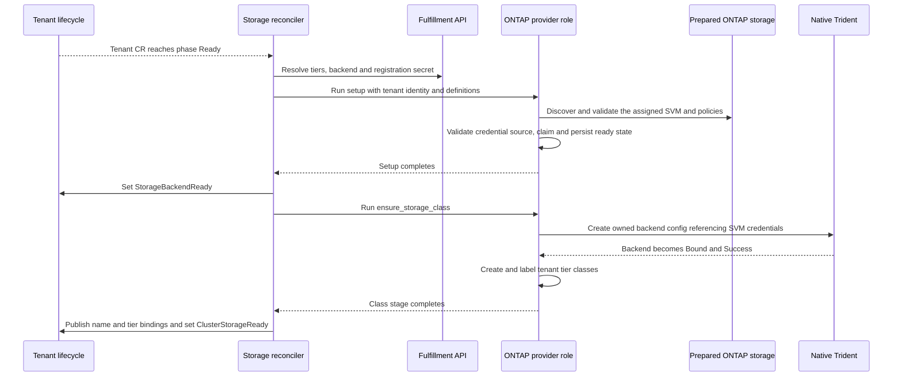

# NetApp preview: configuration and tenant lifecycle

| Field | Value |
|---|---|
| Author(s) | Zoltan Szabo |
| Jira | [OSAC-5813](https://redhat.atlassian.net/browse/OSAC-5813) |
| PRD | [prd.md](prd.md) |
| Date | 2026-10-06 |
| Last updated | 2026-10-09 |
| Status | Draft — named SVM preassignment; hub and dedicated VMaaS |

# 1. Overview

Reuse StorageBackend, StorageTier and the two Tenant storage stages to adopt a
dedicated, administrator-prepared ONTAP SVM. An ONTAP AAP role validates/claims
prepared storage and creates native Trident backend/tier bindings; it does not
create or delete SVMs/LIFs. See [PRD](prd.md) for product requirements.

Credential and manual-release conventions, names and schema changes below are
concrete proposals
for review (§9). The baseline uses separate SVM management endpoints/accounts;
a shared cluster management endpoint remains an alternative requiring agreement.
The MVP preassigns a named SVM to each tenant. It supports one configured VM
hosting cluster per deployment: either the hub or a dedicated remote cluster.

# 2. Goals and Non-Goals

## 2.1 Goals

- Reuse common registration APIs and preserve existing provider behavior.
- Define the admin-preparation, operator and AAP handoffs.
- Record immutable ownership and completed stages so retry reuses the same
  assignment and deletion removes only OSAC-owned configuration.

## 2.2 Non-Goals

- Generic VM/Volume lifecycle, owned by [OSAC-6037](https://redhat.atlassian.net/browse/OSAC-6037); independent VaaS/dynamic attachment is separate stretch work.
- Driver installation automation, OSAC CSI changes, Enclave, CaaS/BMaaS, fabric zoning or HBA setup.
- Automatic SVM/LIF/account/policy provisioning or deletion, free-SVM allocation,
  automated sanitization and new credential-rotation automation.
- Multiple backends, concurrent VM hosting targets, cluster-per-tenant provisioning and other transports.

# 3. Motivation / Background

Backend/tier registration and storage reconciliation exist, but there is no
ONTAP provider role. Dedicated prepared SVMs move topology, address allocation
and array-account/policy creation to infrastructure administrators. OSAC needs
management discovery, a protected assignment/credential handoff and native
backend/classes, rather than a physical provisioning recipe.

# 4. Design

## 4.1 Architecture

| Owner | Responsibility / missing work |
|---|---|
| Configuration owner | ONTAP registration probe; typed tier QoS; UI/CLI support; operator-to-AAP QoS/encryption mapping; API storage-status projection |
| Onboarding owner | ONTAP AAP role; hub/hosting-target routing; prepared-SVM discovery/claim; native backend/classes; persisted progress, target-aware readiness and guarded teardown |
| Cloud Infrastructure Admin / QE | Manual array/FC/native-driver preparation, protected SVM credentials/policies, tested-version documentation and joint VM acceptance |

Registration and tenant creation are independent activities. The following
phases define their handoff; the diagram covers only the later onboarding.

### VM hosting target and resource placement

The hub runs OSAC's API, operator and AAP. The VM hosting cluster runs KubeVirt,
CDI and native Trident; it is either that same hub or one preconfigured dedicated
remote cluster. Dedicated VMaaS does not create a compute cluster per tenant.

| Resource / operation | Cluster |
|---|---|
| Backend/tier API records, registration probe, Tenant CR and conditions | Hub |
| Assignment/progress record in OSAC's configuration namespace | Hub; records the selected hosting target and native resource identities |
| Admin-prepared provisioning Secret and native TBC | Hosting cluster, in the native Trident namespace |
| Tenant StorageClasses and their readiness observation | Hosting cluster; StorageClasses are cluster-scoped |
| VM, DataVolume, PVC and provisioned PV | Hosting cluster; VM/DataVolume/PVC use the tenant namespace, while PVs are cluster-scoped |
| FC worker access and native disk I/O | Hosting cluster's eligible workers |

The infrastructure admin configures the operator and AAP storage/compute jobs
for the same hosting cluster using the existing remote kubeconfig mechanism.
For remote mode, AAP storage jobs receive the mounted kubeconfig through
`OSAC_REMOTE_CLUSTER_KUBECONFIG`; otherwise they use the hub context. The ONTAP
role resolves this through `osac.service.common/get_remote_cluster_kubeconfig.yaml`
in all four provider actions. Target Secret/TBC/class operations use that
kubeconfig explicitly; progress-record operations explicitly use hub access.
A configured but unusable remote connection fails; it never falls back to hub.

Existing Stage 2 playbooks/dispatcher and the operator's StorageClass discovery
already support a selected target. The ONTAP role still needs this routing in
setup, class creation and both teardown actions, including hub-side state writes.
The hub record includes `target_mode` (`hub` or `remote`), `target_cluster_uid`
(the hosting cluster's `kube-system` Namespace UID) and the native namespace.
AAP and the operator read that Namespace through their selected clients to
check the same cluster identity before readiness. Different connection URLs
for the same cluster do not change this identity.
An active assignment cannot be retargeted by changing deployment credentials;
guarded offboarding precedes a target change. This deployment contract adds no
StorageBackend, StorageTier or Tenant request fields.

### 4.1.1 Before deployment: infrastructure preparation

The Cloud Infrastructure Admin prepares one connected OpenShift Virtualization
cluster with supported FC access on every worker eligible for VMs or CDI imports:
HBAs, fabric paths/zoning and multipath. Guests receive virtual disks. The admin
installs a complete native Trident deployment, including CRDs and OpenShift
permissions, and records the ONTAP family/version, Trident/OpenShift versions,
native namespace and eligible worker configuration. For the referenced Trident
25.10 profile, multipath uses `find_multipaths: no`. These are qualification
inputs, not a claim that this version has been deployed or tested.
[Native requirements](https://docs.netapp.com/us-en/trident-2510/trident-get-started/requirements.html).
Existing bootstrap storage starts OSAC; it cannot depend on tenant classes
created afterward.
Before claiming storage, the ONTAP role checks that the native driver and its
required CRDs are available on the VM hosting cluster. Missing prerequisites
fail onboarding with an actionable error; the role does not install the driver.
In dedicated mode these prerequisites apply to the remote hosting cluster;
management-cluster workers do not need HBAs merely to run OSAC services.

The admin supplies cluster-management HTTPS reachability and an approved CA
chain, configured separately in Fulfillment's trust store and AAP's execution
environment. Both clients verify the endpoint's certificate chain, hostname/IP
and validity; neither disables verification. Native Trident receives its trust
through the prepared source Secret described in §4.2. No new backend field or
installer schema is introduced; manual trust setup must be documented.
The discovery account is allowed to read intended SVMs, management/FC interfaces,
workload volumes/LUNs and QoS policies. SVM/LIF/account/policy creation or deletion
privileges are unnecessary for that account. ONTAP management networking is
provider infrastructure; it adds no OSAC Subnet/ExternalIP or VM attachment API.
The [accepted VM networking contract](../OSAC-1435-vmaas-networking/design.md)
continues to govern guest connectivity; storage targeting does not extend it.
Management endpoints must be reachable from hub-side registration/AAP and from
the hosting cluster's native Trident deployment. The admin grants AAP hub-state
access and hosting-cluster Secret/TBC/StorageClass access; AAP and the operator
can read the cluster-identity Namespace, and the operator can read hosting-cluster
classes. Operator, storage jobs and compute jobs use the
same selected hosting target.

### 4.1.2 Register backend and tiers

1. The Cloud Provider Admin creates a protected Fulfillment VALUE password
   Secret in the backend's provider scope, then submits provider `ontap`, cluster
   endpoint and credentials through the existing private API/CLI/UI (§4.3).
2. Fulfillment validates credentials and read-only management/discovery access.
   Failure returns a sanitized error; success persists READY and returns the
   backend ID. No tenant assignment, SVM, native backend or StorageClass is created.
3. The admin registers BLOCK tiers referencing that ID, with optional native
   IOPS ceilings and the existing encryption setting (§4.2).

A registered backend confirms management access, not FC I/O or prepared tenant
storage. Tiers are catalog definitions until their tenant bindings are ready.

### 4.1.3 Before tenant creation: prepare its dedicated SVM

The Cloud Provider Admin chooses the planned tenant metadata name and shares
it, the returned backend ID and tier definitions with the infrastructure admin.
The infrastructure admin uses §4.2's convention to prepare:

1. One dedicated SVM with usable capacity and no previous workload data or
   conflicting assignment. Conventional ONTAP requires assigned aggregates with
   sufficient free space; qualify other array families' capacity model separately
   (ASA r2 differs). Root/configuration volumes are distinguished from tenant
   workload volumes during validation. The native `ontap-san` path creates a
   FlexVol and LUN per PVC; one unused, pre-existing FlexVol is not its dynamic
   capacity contract. [Backend preparation](https://docs.netapp.com/us-en/trident-2510/trident-use/ontap-san-prep.html),
   [SAN allocation model](https://docs.netapp.com/us-en/trident-2510/trident-use/vol-import.html).
2. A separate reachable management LIF allowing HTTPS; `default-management` is
   ONTAP's built-in service policy for management traffic, not an account role.
   An equivalent HTTPS-capable policy is acceptable. Enable FCP and prepare
   SVM-scoped FC target LIFs/WWPNs and zoning. Physical ports may be shared;
   logical FC LIFs belong to their SVM. No separate IP data LIF is needed for FC.
3. An SVM-scoped account authorized for native Trident volume/LUN creation and
   deletion, igroups and LUN mappings, plus the protected credential/CA Secret
   and full assignment metadata. Use NetApp's supported `vsadmin`/equivalent
   profile and verify runtime permissions; GET-only discovery does not prove
   provisioning access. Trident owns these workload operations, while admins
   retain SVM/LIF/account preparation. Discovery cannot recover an account
   password. [Runtime account preparation](https://docs.netapp.com/us-en/trident-2510/trident-use/ontap-san-prep.html).
4. For each capped tier, an SVM-owned, non-shared QoS policy matching its ceiling;
   prepare capacity, licensing/key management and encryption state compatible
   with each tier (§4.2).
   QoS policy creation requires appropriate cluster-administrator privileges.
   [ONTAP QoS creation](https://docs.netapp.com/us-en/ontap-cli-9171/qos-policy-group-create.html).

SVM accounts/native policies are administrator-prepared in this proposed
baseline. OSAC does not choose an arbitrary free SVM. Another tenant needs its
own preparation; missing prerequisites leave storage unavailable.
The provisioning Secret is prepared in the selected hosting cluster, not copied
to a tenant namespace or assumed to exist on the hub in dedicated mode.

The management endpoint/account combination is an open preview decision (§9.5):

| Model | Native Trident configuration | Preparation and privilege implications |
|---|---|---|
| Proposed baseline: per-SVM management | SVM management LIF, explicit `svm`, protected SVM-scoped account | Each SVM needs its own reachable HTTPS endpoint and account. |
| Alternative: shared cluster management | Cluster management LIF, explicit `svm`, separately authorized cluster-scoped provisioning account | Endpoint is shared; credential permissions and protected source conventions need qualification. |

Trident documents SVM management LIFs for SVM/`vsadmin` credentials and cluster
management LIFs for cluster/`admin` credentials. Endpoint substitution alone is
insufficient. The registration/discovery account stays read-only in either model;
the role never falls back to it for provisioning. The shared model needs an
agreed protected credential handoff, not a new tenant request header. Until
confirmed, the preparation steps and example use the per-SVM baseline.
[Native management/SVM settings](https://docs.netapp.com/us-en/trident-2510/trident-use/ontap-san-examples.html).

### 4.1.4 Create tenant and adopt storage

Normal tenant creation produces a Tenant CR. Its core lifecycle reaching
`phase=Ready` triggers the existing storage reconciler; this does not yet mean
its storage is ready.



Stage 1 resolves the hosting target and exact SVM name, checks its UUID, management/FCP configuration,
prepared policy values, credential authorization and absence of unclaimed workload
data, then claims it for the current Tenant CR UID (§4.6). Stage 2 creates native
backend/classes (§5). The operator polls jobs and observes configuration/classes;
its existing reconciliation retries corrected preparation and completed stages.
The claim/source Secret is on the hosting cluster, the recovery record is on the
hub, and TBC/class creation and observation use the hosting target. No ready
binding is published before native backend/class success on that target.

The resulting `{name, tier}` bindings feed the separate shared VM path. A Tenant
User selects a tier through normal OSAC VM creation. That workstream creates a
private OSAC Volume record for bookkeeping before creating the DataVolume;
CDI creates its PVC, and Kubernetes invokes native Trident through the selected
StorageClass to provision ONTAP storage. The OSAC record must not also trigger
independent physical provisioning through the existing Volume reconciliation
or direct CSI CreateVolume calls. That would allocate storage again when the
PVC invokes Trident. No direct ONTAP Volume provisioner is required by this path.
OSAC-6037 owns the bookkeeping-only reconciliation separation, Volume/DataVolume/
PVC identity, status and cleanup. These shared changes are required work, not
implementation already established by tenant onboarding. Joint acceptance
verifies actual FC VM I/O and shared-worker isolation (§9.1/§9.3).

### 4.1.5 Delete tenant and retain prepared infrastructure

Shared workload/data guards run first. OSAC deletes its classes and native
backend configuration, waits for Trident cleanup and removes departing OSAC
access. It preserves the prepared SVM, LIFs, account, native policies and source
credential Secret, recording the assignment as retained. Failed cleanup blocks
completion; another tenant's bindings remain unchanged.

Before reuse, the infrastructure admin verifies data cleanup and revokes/replaces
old account access, then explicitly prepares a new credential generation.
OSAC checks identity/dependencies and the protected handoff; it cannot attest to
array sanitization merely from names. The manual-release proposal is in §4.6.

## 4.2 Data Model / Schema Changes

StorageBackendSpec stays unchanged: `provider`, `description`, `endpoint` and
`credentials`. No `spec.ontap` fields, topology recipe, new table or CRD is needed.
Tenant creation input also stays unchanged. The backend ID plus planned tenant
name identifies prepared storage; protected metadata confirms ownership.

Add a typed optional tier extension following `IdentityProviderSpec.oneof config`:

```protobuf
// Add to private BackendAssociation; existing fields 1–4 stay unchanged.
oneof provider_qos {
  OntapAssociationConfig ontap = 5;
}
message OntapAssociationConfig {
  option (cleanapi.message).private = true;
  int64 max_iops = 1 [(buf.validate.field).int64 = {gte: 0, lte: 2147483647}];
}

// Add to the existing private TenantConditionType enum.
// Preserve the existing COMPUTE_INFRASTRUCTURE_READY = 3.
TENANT_CONDITION_TYPE_STORAGE_BACKEND_READY = 4;
TENANT_CONDITION_TYPE_CLUSTER_STORAGE_READY = 5;
```

The oneof is not a nested JSON object: input is `spec.backends[].ontap.maxIops`.
Positive values set a per-volume ceiling; zero/unset adds no OSAC tier cap and
does not remove other array constraints. It is not guaranteed/reserved IOPS.
The proposed numeric range matches ONTAP's REST `fixed.max_throughput_iops`
field, not every CLI/string limit. For a capped tier, the role verifies the
prepared policy's SVM UUID, fixed rather than adaptive type,
`fixed.capacity_shared=false` and exact numeric ceiling; unexpected additional
limits fail preparation. Public tier shape stays unchanged. Existing read/write
bandwidth fields must be zero for ONTAP; they are not equivalent to combined IOPS.
[Policy schema](https://docs.netapp.com/us-en/ontap-restapi-9171/get-storage-qos-policies.html),
[Ceiling semantics](https://docs.netapp.com/us-en/ontap/performance-admin/set-throughput-ceiling-qos-task.html).

The proposed contract for generic `encryption_enabled` describes the requested
data-at-rest outcome: true requires encrypted volumes; false requests unencrypted
volumes. Prepared capacity must
support that outcome. Trident's NVE setting does not disable inherited aggregate
encryption (NAE), so a false tier on necessarily encrypted capacity is rejected,
rather than advertised as unencrypted. The role maps the boolean to the native
pool's string encryption default and verifies the resulting state during joint
acceptance. Native pools reference the matching pre-created QoS policy; zero/unset
omits the OSAC tier policy. [Native pool settings](https://docs.netapp.com/us-en/trident-2510/trident-use/ontap-san-examples.html),
[Encryption behavior](https://docs.netapp.com/us-en/trident-2510/trident-reco/security-reco.html).

### Assignment and credential sources

The assignment connects an OSAC tenant/backend to an administrator-prepared
SVM and its provisioning credentials. AAP must find that exact storage without
asking the tenant to supply SVM names or passwords. The proposed baseline uses
a naming convention shared by the infrastructure admin and AAP:

1. The Cloud Provider Admin supplies the registered backend ID, planned tenant
   metadata name and tier names to the infrastructure admin.
2. The infrastructure admin calculates the names below and prepares the SVM,
   credential Secret and any capped-tier policies under those names.
3. AAP receives the same identities from the operator, calculates the names,
   finds and validates the prepared resources, then claims the assignment.

"Computable" means the same inputs produce the same names before the Tenant CR
exists. `assignment_key` and `tier_key` are calculated name components, not new
API fields. Calculating them creates no resources. This convention is an OSAC
proposal, not an ONTAP requirement; an available-SVM pool or explicit mapping
would change this lookup contract. Named preassignment is the selected MVP;
pool allocation is outside its scope.

```text
assignment_key = lowercase_hex(sha256(backend_id + "|" + tenant_name))[:16]
tier_key = lowercase_hex(sha256(tier_name))[:16]
SVM = osac-<assignment_key>-svm
credential Secret = osac-<assignment_key>-credentials
capped-tier policy = osac-<assignment_key>-<tier_key>-qos
```

Tenant name is the immutable metadata name, not its display name. The short key
is a name component, not ownership proof. A protected Kubernetes Secret in the
configured native Trident namespace holds `username`, `password`, and `ca.crt`
(the approved PEM CA chain, with no private key), plus annotations:

| Annotation | Value |
|---|---|
| `osac.openshift.io/storage-backend` | Full Fulfillment backend ID |
| `osac.openshift.io/tenant` | Planned tenant name |
| `osac.openshift.io/storage-resource-id` | Discovered SVM UUID |
| `osac.openshift.io/storage-assignment-state` | Initially `available`; OSAC writes `claimed`, then `retained` |
| `osac.openshift.io/storage-tenant-uid` | OSAC writes the full Tenant CR UID when claiming |

This administrator source is separate from the Fulfillment registration password
Secret. It is not generated by OSAC and has no Tenant garbage-collection owner
reference. Here, `available` means the admin prepared this named assignment for
adoption; it is not a built-in ONTAP availability state or permission to select
any unassigned SVM. AAP checks the Secret through its authorized Kubernetes
connection; native Trident references it directly. Namespace/access configuration
is part of the handoff (§5, IC-4). Tenants cannot read or change the handoff.

AAP decodes Kubernetes `data["ca.crt"]` to PEM and uses it to verify the selected
runtime management endpoint before claiming the assignment, including hostname/IP
and expiry. It then base64-encodes the PEM once into TBC `spec.trustedCACertificate`;
it must not base64-encode the already encoded Secret data again. The credential
reference alone does not make Trident load `ca.crt`; this explicit projection is required.
Missing/invalid trust fails preparation without an insecure fallback. Trident's
versioned REST client enables certificate verification when this CA configuration
is supplied. [Native CA setting](https://docs.netapp.com/us-en/trident-2510/trident-use/ontap-san-examples.html),
[Trident v25.10.0 REST client](https://github.com/NetApp/trident/blob/v25.10.0/storage_drivers/ontap/api/ontap_rest.go).
The versioned ONTAP credential parser reads username/password and leaves the
extra CA key unused; the role owns the CA projection.
[Credential parser](https://github.com/NetApp/trident/blob/v25.10.0/storage_drivers/types.go).

### 4.2.1 Worked example: one array, two tenants

All values are illustrative, not lab inventory. The Cloud Provider Admin uses
existing backend input; no physical placement fields are submitted:

```json
{
  "metadata": {"name": "netapp-fc"},
  "spec": {
    "provider": "ontap",
    "endpoint": "https://ontap.example.invalid",
    "credentials": {
      "username": "storage-discovery",
      "passwordSecret": {"id": "registration-secret-id"}
    }
  }
}
```

Suppose registration returns `backend-id`. The admin registers `fast`:

```json
{
  "metadata": {"name": "fast"},
  "spec": {
    "protocol": "STORAGE_PROTOCOL_BLOCK",
    "backends": [{
      "backendId": "backend-id",
      "encryptionEnabled": false,
      "ontap": {"maxIops": "5000"}
    }]
  }
}
```

`maxIops` is a ProtoJSON int64 string; IC-4 converts it to a numeric Ansible value.
Before normal tenant creation, infrastructure administrators prepare:

| Resource | tenant-a | tenant-b |
|---|---|---|
| Assignment key | `79457936f209a67b` | `1dfcf6434a6218ff` |
| SVM | `osac-79457936f209a67b-svm` | `osac-1dfcf6434a6218ff-svm` |
| Management LIF address | `198.51.100.100` | `198.51.100.101` |
| Credential Secret | `osac-79457936f209a67b-credentials` | `osac-1dfcf6434a6218ff-credentials` |
| Non-shared 5,000 IOPS policy | `osac-79457936f209a67b-115dc3606fbf8691-qos` | `osac-1dfcf6434a6218ff-115dc3606fbf8691-qos` |

Each Secret carries `username`, `password`, the approved CA chain in `ca.crt`,
its full backend/name/SVM UUID and `available` state. For this false-encryption
tier, the admin chooses capacity that can create unencrypted volumes; an
NAE-encrypted aggregate would be incompatible.
Onboarding A receives IC-4 input, discovers A's management endpoint, claims its
Secret and configures native Trident using A's SVM account. B repeats this with
its own prepared resources. The common backend endpoint/credential is used for
discovery, while native volume operations use separate SVM endpoints/accounts.
Offboarding A removes only A's OSAC configuration and retains its prepared
resources; B remains usable. No tenant supplies topology or array credentials.

For A, the essential TBC fields assembled by AAP are below. This excerpt omits
the ownership metadata and tier virtual pools specified in IC-5:

```yaml
apiVersion: trident.netapp.io/v1
kind: TridentBackendConfig
metadata:
  name: ontap-79457936f209a67b
  namespace: trident
spec:
  version: 1
  backendName: ontap-79457936f209a67b
  storageDriverName: ontap-san
  sanType: fcp
  useREST: true
  svm: osac-79457936f209a67b-svm
  managementLIF: 198.51.100.100
  trustedCACertificate: "<base64-encoded PEM from source ca.crt>"
  credentials:
    name: osac-79457936f209a67b-credentials
  deletionPolicy: delete
```

The SVM and credential Secret already exist. AAP creates this configuration;
Trident uses its Secret reference for subsequent volume provisioning. Neither
the SVM password nor the read-only discovery login is embedded in the TBC.
`version: 1` is the backend configuration format, not the installed Trident
software version; the latter is recorded during infrastructure preparation.
The illustrative management IP must appear in the server certificate's IP SAN;
alternatively use a qualified hostname matching its DNS SAN. Fulfillment and AAP
discovery trust their cluster endpoint separately from this native runtime CA.

## 4.3 API Changes

Keep existing private Create/Get/List/Update methods. Backend credentials retain
exactly-one password/password_secret validation. For ONTAP, Create performs a
read-only probe before persisting READY: verified HTTPS, no redirects, a proposed
10-second total deadline, cluster version and bounded reads of the discovery
surfaces in §4.1.1. Empty results are valid before tenant preparation; forbidden
required reads are not. Repeat after a credential Update, validating merged state.
Return sanitized `InvalidArgument` for invalid input/401, `FailedPrecondition`
for missing discovery permissions/403, `Unavailable` for connectivity/TLS and
`DeadlineExceeded` for timeout. No array mutation is part of registration.

Preserve provider immutability. For the proposed preview, reject ONTAP endpoint
changes and tier backend/QoS/encryption mutations requiring rebinding; description
and backend credentials remain updateable. Replacement follows existing
resource dependency guards. Existing providers retain their behavior.

Tier validation looks up its backend: one existing association, BLOCK, a native
cap in 0–2,147,483,647 and zero generic bandwidth. An ONTAP QoS branch on another
provider returns `InvalidArgument`; an absent backend returns `NotFound`.
Unset native QoS is valid. Proto validation handles local constraints; provider agreement
needs the API lookup. No Tenant SVM/account parameters or new Secret API type.

## 4.4 Scalability and Performance

One prepared SVM and OSAC configuration/native backend per tenant; one virtual
pool/class per tier. Capacity, SVM/FC limits and preparation remain infrastructure
responsibilities. Backend/credential API reads stay deduplicated; exact-name/UUID
provider queries avoid whole-array scans. Retained assignment records are small
and cannot be discarded while their infrastructure can be reassigned.

## 4.5 Security Considerations

The discovery account remains read-only. The administrator-supplied SVM account
serves native volume operations; cluster credentials are never its fallback.
Use the explicit CA handoff in §4.2, existing secret resolution, `no_log` and
fact clearing.
Do not return credentials in AAP results, API status or tenant namespaces.
FC access uses authorized igroups/LUN mappings and zoning, not export policies.
Worker HBA WWPNs identify trusted hosts, not tenant VMs. A shared worker may need
authorized LUN access in several tenant SVMs; separate SVMs/classes do not give
each guest a distinct physical initiator. ONTAP documents that one initiator can
interact with several SVMs. Qualify Trident's deployed igroup/LUN mappings
and correct guest device assignment, alongside API/admission authorization,
before claiming shared-worker tenant isolation (§9.3).
[ONTAP FC host access](https://docs.netapp.com/us-en/ontap/san-admin/san-provisioning-fc-concept.html),
[Multi-SVM initiators](https://docs.netapp.com/us-en/ontap-restapi-9171/get-protocols-san-initiators.html).

## 4.6 Failure Handling and Recovery

Persist `ontap-tenant-<assignment_key>` in the Tenant CR's configuration namespace,
with existing discovery labels, full Tenant CR UID/backend/SVM UUID, source Secret
UID/namespace, `target_mode`/`target_cluster_uid`, native namespace,
endpoints/WWPNs, policy names, owned native resource IDs and phase. Do not store
another copy of the SVM password. Record intended work before mutation,
then completed identities after readback. The operator checks phase/UID, not
Secret presence, before setting storage readiness.
It also checks the recorded hosting target against its configured target.
Delete uses that recorded placement; a changed or unavailable target blocks
cleanup rather than redirecting it to the hub or another cluster.

Claim source metadata with Kubernetes resource-version checks; conflicts retry
after reread. A retry with the same UID resumes completed work. A different UID,
SVM UUID, backend or stale credential generation is rejected. If claiming succeeds
but the job stops before recording completion, the same UID can recover from the
validated source claim. Prepared resources are not OSAC deletion targets.

| Failure | Observable result / recovery |
|---|---|
| Backend/tier API or registration credential unavailable | Storage stays false; no default-class fallback; retry resolution |
| Missing SVM, source Secret, management/FCP configuration or policy | `OntapPreparationMissing` / `OntapConfigurationInvalid`; no automatic infrastructure creation; admin corrects preparation |
| Missing CA, invalid certificate or incompatible capacity/QoS/encryption | `OntapConfigurationInvalid`; no insecure fallback or ready binding; admin corrects the prepared source/endpoint/storage |
| SVM account unusable or discovery permission missing | `OntapCredentialInvalid` / `OntapPermissionDenied`; no cluster-account substitution |
| SVM UUID/assignment mismatch or unclaimed workload data | `OntapOwnershipConflict` / `OntapDependenciesRemain`; stop without mutation |
| Native driver missing or bind deadline exceeded | `OntapDriverUnavailable` / `OntapBackendNotReady`; no ready class publication |
| Cleanup failure or active/unverifiable dependencies | `OntapCleanupFailed` / `OntapDependenciesRemain`; retain state/source credential and finalizer |

Setup uses `validating`, then `ready` only after preparation/claim readback.
Native class setup waits a proposed 300 seconds for TBC Bound/Success; timeout
fails the stage, not the Tenant's completed identity onboarding. Restart/retry
reuses recorded resources. Runtime fabric failures use PVC/Trident events and
recorded WWPNs for manual correction; control-plane readiness is not FC validation.

Offboarding order: verify shared/native/array data guards → delete owned classes
→ delete TBC and wait for native backend disappearance → record `retained` on
assignment/source → clear storage finalizers after readback. Propagate provider
errors currently swallowed by shared teardown; reuse `BlockDeletionOnFailure=true`.
Delete jobs require the original Tenant UID and inspect partial state even if
setup never became ready. Never delete prepared SVM/LIF/account/policy/source.

Retained assignment records survive Tenant deletion, without a Tenant garbage-
collection owner reference. Recreating the same name cannot adopt the old claim.
Proposed manual release: after offboarding and administrator-verified data/access
cleanup, replace the credential Secret with a new Kubernetes UID, matching full
assignment metadata and `available` state without the old claim. A new onboarding
may replace a retained record only after verifying the new source generation,
no active native dependencies and no previous workload data. Deleting the old
Secret alone is not release. OSAC does not automate sanitization or credential
rotation; trusted infrastructure admins perform those operations. Review §9.4.

## 4.7 RBAC / Tenancy

Keep provider-only registration and tenant-authorized consumption. OSAC-created
classes/backend configuration carry tenant/owner-reference annotations, existing
discovery labels and full UID ownership. Prepared sources/retained records carry
tenant metadata but no garbage-collection relationship to the Tenant. AAP needs
protected source-Secret access in the configured native-driver namespace.
Selectors and shared-worker igroups do not enforce tenant authorization: verify
API/admission prevents selection of another tenant's class, and the trusted
worker exposes only the authorized disk to each guest (§9.3). The preview uses
one shared VM hosting target per deployment, either the hub or a dedicated
remote cluster; cluster-per-tenant was not selected.

## 4.8 Extensibility / Future-Proofing

Backend registration stays generic. Typed tier oneof branches enforce at-most-one
provider extension; the API verifies its backend match. Generic AAP QoS maps keep
the dispatcher provider-independent. Prepared-resource discovery and credential
conventions belong to the ONTAP role; no generic allocator/driver framework.

# 5. Interface Changes

R1–R5 are local anchors to the unnumbered [PRD](prd.md), shared by the [test plan](testplan.md).

| Reference | PRD requirement / source |
|---|---|
| R1 | Backend registration/actionable access errors — In Scope; provider-admin story |
| R2 | Native block tiers/performance — In Scope; provider-admin story |
| R3 | Isolated prepared-SVM adoption, readiness/retry — In Scope; Required verification |
| R4 | Guarded offboarding, retention and safe reuse — In Scope; Required verification |
| R5 | Ready tier handoff/joint VM acceptance — tenant story; Dependencies |

## IC-1: ONTAP backend registration

**Requirements:** R1, R3. Existing StorageBackend fields and protected password
references; add the read-only management/discovery probe (§4.3). No ONTAP topology
branch. Registration and onboarding remain separate operations.

## IC-2: ONTAP tier association

**Requirements:** R2, R3. Private typed `BackendAssociation.provider_qos` oneof,
ONTAP cap and provider/protocol validation (§4.2–4.3). Preserve generic encryption.

## IC-3: Administration UI and CLI

**Requirements:** R1, R2. Add ONTAP provider selection and native tier IOPS input;
reuse endpoint/credentials, with no placement form. Show sanitized access/preparation
errors and storage readiness. Advance the UI's selected API baseline deliberately,
regenerate bindings and retain existing-provider payload behavior.

## IC-4: Operator → AAP request

**Requirements:** R2, R3. Keep common BackendConnection unchanged. Add optional
generic `provider_config` to TierQosLimits plus tier `encryption_enabled`.
Map the typed ONTAP cap explicitly to numeric `qos_limits.provider_config.max_iops`;
serializers/dispatcher pass it through. No reflection or vendor-named AAP wrapper.

```yaml
osac_job_vars:
  resource:
    metadata: {name: tenant-a, namespace: osac-system, uid: tenant-uid}
  storage_tier_definitions:
    - name: fast
      protocol: block
      provider: ontap
      backend_id: backend-id
      encryption_enabled: false
      qos_limits:
        static_limits: {max_reads_bw_mbps: 0, max_writes_bw_mbps: 0}
        provider_config: {max_iops: 5000}
  storage_backend_connections:
    backend-id:
      endpoint: https://ontap.example.invalid
      username: storage-discovery
      password: "<resolved only at runtime>"
```

Forward only referenced connections. The role calculates the assignment and
reads/discovers prepared metadata; no physical recipe or SVM password is added
to extra_vars. The payload is not a complete TBC: the role combines the sources
below to construct it.

| TBC input / prerequisite | Source and use |
|---|---|
| Tenant name/namespace/UID, backend ID and tier intent | Operator job variables; identify ownership and requested tier settings |
| Cluster endpoint and read-only discovery login | `storage_backend_connections`; find and validate prepared ONTAP resources |
| SVM, credential Secret and policy names | Proposed assignment convention (§4.2); lookup only, not resource creation |
| SVM UUID and eligible management/FC endpoints | ONTAP discovery; validate identity and use the agreed management-endpoint rule (§9.5) |
| Runtime provisioning credentials | Admin-prepared Kubernetes Secret; TBC sets `credentials.name`, never the password |
| Native management trust | The source Secret's PEM `ca.crt`; AAP verifies the endpoint, then base64-encodes it into `spec.trustedCACertificate` |
| Native namespace and Kubernetes connection | Role/deployment configuration; locate the source Secret and create/observe the TBC |
| Driver/protocol/version, lifecycle and tier pool settings | ONTAP role constants and resolved tier/native-policy configuration (IC-5) |

Role advertises block/VMaaS. Provider-role configuration supplies
`ontap_storage_trident_namespace` (proposed default `trident`). The existing
dispatcher supports `storage_provider_target_kubeconfig`; omitted, Kubernetes
modules use the execution environment's default context. The configured identity
must have source-Secret inspection/claim and TBC management permissions in the
native namespace, plus StorageClass permissions. Source Secret and TBC must be
on the cluster running native Trident. Discovery cannot retrieve an existing
password, and registration credentials are never substituted for provisioning.
The ONTAP role and these permission/preflight checks remain implementation work.
Remote targeting and hub-side ownership records need the explicit routing in
§4.1; a namespace name alone does not identify the correct cluster. Storage
and compute execution environments must mount the same configured remote
connection, while retaining the hub connection for OSAC state. Missing remote
credentials or a target mismatch leaves storage not ready.

In this preview profile set `csi_driver_install_enabled=false` and
`storage_provider_csi_backends_enabled=false`; check the full native deployment
rather than installing OSAC's raw controller. Preserve existing provider paths.
All setup/delete jobs carry metadata.name/namespace/uid.

## IC-5: AAP state and consumption output

**Requirements:** R3, R4, R5. Hub config/assignment record follows §4.6; safe AAP
results contain identities/endpoints/WWPNs and source Secret reference, not passwords.
It includes the hosting target mode/cluster UID/native namespace. The source
Secret and TBC belong to that target; the hub record contains references and progress only.

TBC `ontap-<assignment_key>` in the configured native namespace references the
prepared credential Secret: `storageDriverName=ontap-san`, `sanType=fcp`, discovered
`svm`/SVM `managementLIF`, explicit `trustedCACertificate` from source `ca.crt`,
`useREST=true`, `deletionPolicy=delete`. Each tier virtual
pool has `osacOwner`, `osacBackend`, `osacTier` labels and matching QoS/encryption
defaults. Omit IP `dataLIF`. [Native FC settings](https://docs.netapp.com/us-en/trident-2510/trident-use/ontap-san-examples.html),
[credential references and backend lifecycle](https://docs.netapp.com/us-en/trident-2510/trident-use/backend-kubectl.html).

Class `ontap-<assignment_key>-<tier_key>` uses `csi.trident.netapp.io`,
Delete/Immediate and the matching owner/backend/tier selector. Full tenant UID
belongs in annotations/state; the selector naming key alone is not authorization.
Existing labels/results populate `Tenant.status.storageClasses=[{name, tier}]`,
`storage_provider_storage_class_names` and `tenant_storage_classes`. OSAC-6037 owns
PVC/DataVolume modes and Volume record correlation/status/cleanup; the catalog's
BLOCK protocol does not choose Kubernetes `volumeMode`. Qualify those modes with
the native FC driver: filesystem/RWO supports a simple VM, while RWX requires
raw Block. This does not add live migration to the MVP.
[Native VM profile](https://docs.netapp.com/us-en/trident-2510/trident-get-started/requirements.html).
This output is not proof of completed consumption integration. The agreed native
path uses private Volume bookkeeping followed by DataVolume/PVC-driven Trident
provisioning (§4.1.4).
OSAC-6037 must preserve disk identity/status/cleanup and bypass independent OSAC
Volume allocation. This feature supplies the ready class binding; no direct
ONTAP Volume provisioner or CSI allocation adapter is added.

## IC-6: Readiness, retries and teardown

**Requirements:** R3, R4, R5. Reuse the four existing provider actions and storage
conditions/jobs/finalizers, with prepared-resource ownership/progress checks.
The actions are `setup`, `ensure_storage_class`, `teardown_cluster_storage` and
`teardown_backend`; setup validates/adopts, and teardown preserves prepared array
resources while removing OSAC configuration.
Add the private API condition values in §4.2 and project both operator storage
conditions, reasons and messages through `TenantStatus.conditions` to UI/CLI/API.
IDP synchronization stays distinct from storage readiness. Missing AAP/catalog/
credential/UID information blocks ONTAP teardown rather than a legacy skip.

# 6. Alternatives Considered

| Decision | Alternative / tradeoff |
|---|---|
| Dedicated prepared SVM | Automatic creation needs topology/addressing and privileged array mutations. Pool selection adds availability, allocation and release coordination; the MVP uses named preassignment. |
| Deterministic resource names | An explicit admin-prepared tenant/backend-to-SVM/Secret mapping accommodates existing names but needs a defined protected record and lookup. Named preassignment supplies the MVP lookup contract. |
| Administrator-supplied credentials/policies | OSAC-generated accounts/policies reduce admin steps but need creation privileges and revocation ownership; not assumed by the prepared-SVM baseline (§9.4). |
| Per-SVM management endpoint | A shared cluster endpoint with explicit SVM selection is a preview alternative; it requires cluster-scoped provisioning credentials and a qualified handoff. Retain the per-SVM baseline pending §9.5. |
| Native Trident | OSAC CSI conflicts with the preview profile. Direct CSI allocation followed by DataVolume/PVC can provision twice; use native PVC provisioning and OSAC-6037 bookkeeping. |
| Typed tier oneof | Bare optional branches permit conflicts; Struct/Any weaken generated validation/forms or add unpacking. Typed branches with generic AAP pass-through preserve extensibility. |
| Retained assignment record | Secret name/presence alone loses ownership on recreation. Durable full identity/source-generation checks add small state but allow safe retry and explicit manual release. |
| Numeric IOPS ceiling | Translating read/write bandwidth changes semantics; referencing arbitrary policy names hides cap meaning. A typed cap plus prepared matching non-shared policy is explicit. |

# 7. Observability and Monitoring

Reuse Tenant conditions, AAP history and Kubernetes/Trident events. Report
provider/tenant/backend/stage/reason and retained infrastructure; redact passwords.
No new metrics or continuous fabric-health monitor. API status projection is
required work, not implied by existing IDP status.

# 8. Impact and Compatibility

Deploy matched proto/API/operator/AAP/UI contracts before admitting ONTAP; existing
providers need no migration. Preserve field tags and public tier output. Downgrade
requires guarded NetApp cleanup and accounting for retained claims; no supported
in-place OSAC upgrade is introduced. Document preparation/naming, native driver
version/trust, source credentials, native policy mapping and manual release.
No installer value/schema or Enclave change; configure existing AAP provider
settings through its established path.

[OSAC-6037](https://redhat.atlassian.net/browse/OSAC-6037) owns shared disk identity,
provisioning and cleanup. The [test plan](testplan.md) separates DEV boundary
coverage from QE two-tenant FC VM/retention acceptance. Proposed live harnesses
and unverified lab permissions remain execution gaps.

Preview acceptance records the actual ONTAP/Trident/OpenShift versions and host
profile; verifies discovery and native CA trust, usable capacity/runtime
permissions, tier policies/encryption and source ownership; then executes the
two-tenant VM persistence/isolation and guarded retention cases for both hosting
modes. Documentation compatibility and successful management GETs do not satisfy
those deployed checks. Trident 25.10 and ONTAP 9.17.1 are the reference evidence
for this design; the installed profile still needs qualification.

# 9. Open Questions

## 9.1 What ready-class and Volume/DataVolume identity handoff does the shared VM path require?

- **Owner:** Configuration/onboarding owners and OSAC-6037 workstream.
- **Impact:** Confirm authorized `{name, tier}` selection, private Volume-to-
  DataVolume/PVC identity/status/cleanup and the bookkeeping-only reconciliation
  bypass. Native PVC/Trident provisioning is the intended architecture; these
  shared implementation details remain open, outside onboarding. PRD OQ-1.

## 9.2 Does the target lab meet the prepared-SVM/FC contract?

- **Owner:** QE / infrastructure owners and infrastructure/partner workstream.
- **Impact:** Verify ONTAP family/version, discovery/SVM account permissions,
  management trust, native QoS/encryption, two prepared SVMs, worker FC paths,
  zoning, native Trident/OpenShift versions, multipath settings and agreed PVC
  volume/access modes. Read-only management discovery has been exercised; native
  provisioning and FC VM acceptance remain pending. `useREST=true` must be
  qualified on the target version. PRD OQ-2/OQ-4.

## 9.3 Do shared FC workers and native API access preserve tenant disk isolation?

- **Owner:** Storage Working Group / architects / QE / shared-consumption owners.
- **Impact:** ONTAP supports an initiator accessing several SVMs; the remaining
  question is deployed enforcement. Verify Trident's mappings for the shared
  worker WWPNs, each VM's authorized disk exposure and API/admission denial of
  another tenant's class/PVC. Separate SVMs alone do not prove those boundaries.
  Missing enforcement needs an owner and blocks acceptance of this profile.
  [Vendor initiator contract](https://docs.netapp.com/us-en/ontap-restapi-9171/get-protocols-san-initiators.html).
  PRD OQ-3/OQ-6.

## 9.4 Are the credential and manual-release conventions accepted?

- **Owner:** Storage Working Group / Core-secrets and infrastructure owners.
- **Impact:** Agree the protected credential/CA source Secret, retained record and
  new-generation release checks. Administrator-supplied credentials/native policies are the stated
  draft baseline, not an answered credential decision. Changing to OSAC-created
  accounts/policies changes privileges and teardown ownership. The baseline uses
  a prepared Kubernetes Secret; sourcing credentials from the Fulfillment secret
  service instead also needs a defined lookup and materialization into Trident's
  namespace. ONTAP discovery cannot recover existing passwords. PRD OQ-3/OQ-4.

## 9.5 Which management endpoint and account scope are qualified for preview?

- **Owner:** Storage Working Group / infrastructure owners / onboarding owner.
- **Impact:** Confirm per-SVM endpoint/account or shared cluster endpoint with
  explicit SVM selection and cluster-scoped provisioning permissions (§4.1.3).
  Changing the baseline affects credential-source validation, native TBC settings
  and preparation/acceptance; the common read-only discovery account stays
  separate. Do not introduce a new backend field until the selected handoff
  demonstrates a need. PRD OQ-5.

---

## Provenance

Authored: draft @ design 0.11.3 - 2bd6607, workspace osac-5813-netapp-integration @ c8d0d8890
Final: revise @ design 0.11.5 - 2c52e61, workspace osac-5813-netapp-integration @ c8d0d8890

> Context changed between draft and revise.

<!-- ai-workflow-provenance:{"schema_version":1,"provenance_kind":"session","workflow":"design","workflow_version":"0.11.5","ai_workflows":"2c52e61","source_repo":"c8d0d8890","source_repo_branch":"osac-5813-netapp-integration","commits_behind_main":0,"commits_ahead_main":0,"main_ref":"main","phases":["draft","revise","revise","revise","revise","revise","revise","revise","revise","revise"],"authoring_modes":["skill"],"context_changed":true,"origin_untracked":false} -->
