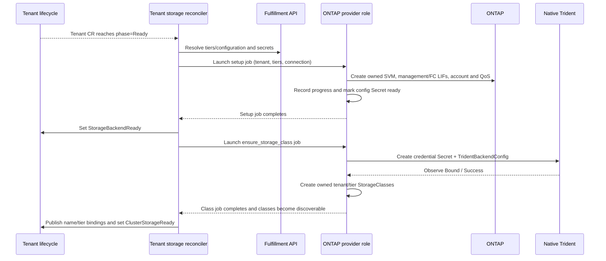

# NetApp preview: configuration and tenant lifecycle

| Field | Value |
|---|---|
| Author(s) | Zoltan Szabo |
| Jira | [OSAC-5813](https://redhat.atlassian.net/browse/OSAC-5813) |
| PRD | [prd.md](prd.md) |
| Date | 2026-10-06 |
| Status | Draft proposal for interface agreement; native Trident selection is open |

# 1. Overview

Reuse StorageBackend, StorageTier and Tenant storage reconciliation; add an ONTAP Ansible provider for isolated SVM/LIF lifecycle and tenant/tier bindings. Native Trident is proposed, pending agreement (§9). See [PRD](prd.md) for requirements.

# 2. Goals and Non-Goals

## 2.1 Goals

- Keep common backend/tier APIs and existing provider paths compatible.
- Define the configuration → operator → AAP contract.
- Record each tenant's created resources and completed steps; retries reuse them and cleanup deletes only resources owned by that tenant.

## 2.2 Non-Goals

- Generic VM/Volume lifecycle: [OSAC-6037](https://redhat.atlassian.net/browse/OSAC-6037); independent VaaS/dynamic attachment is separate stretch work.
- Driver installation automation, OSAC CSI changes, Enclave, CaaS/BMaaS, fabric zoning or HBA setup.
- Multi-backend/cluster preview profiles, other transports, pre-created SVM allocation or new credential-rotation automation.

# 3. Motivation / Background

Existing registration and operator/AAP plumbing lack ONTAP configuration and a provider role. Reuse the two tenant-storage stages: backend setup, then StorageClasses. [Codebase: `storage_tier_definitions.go`; `storage_controller.go`]

# 4. Design

## 4.1 Architecture

| Workstream | Responsibility |
|---|---|
| Configuration owner | Validate backend/tier input, check management access during registration, add CLI/UI fields and map operator-to-AAP input |
| Onboarding owner | AAP role, tenant state, native backend/classes, NetApp readiness/recovery and teardown |
| Infrastructure / QE | Array privileges/address pool, worker FC access, native driver installation, zoning and joint VM acceptance |

**Registration is independent of tenant onboarding.** After manual ONTAP/FC/native-driver preparation, a **Cloud Provider Admin** uses the existing private API, CLI or UI to:

1. Create a StorageBackend. Validate the submitted fields and make a read-only HTTPS request to ONTAP to check the endpoint/credentials (§4.3); persist the backend if those checks pass.
2. Create StorageTiers referencing that backend. Validate their protocol/QoS settings and persist them. Registration creates no tenant SVM, LIF or native backend.

**Tenant onboarding starts later.** With the backend/tiers registered, normal tenant creation produces a Tenant CR. Its core onboarding reaching `phase=Ready` triggers storage reconciliation:



The operator polls AAP jobs and watches Tenant, configuration Secret and StorageClass changes to advance/retry the stages. The diagram ends at storage-ready onboarding; VM disk creation is a separate dependency (§8). The Cloud Infrastructure Admin handles any zoning required for newly allocated target WWPNs. Configuration readiness does not prove FC I/O; QE checks it. Tenant deletion triggers guarded offboarding (§4.6).

Add a tested, pinned `netapp.ontap` collection to the AAP execution environment; REST modules handle provider operations. The management LIF uses ONTAP's built-in `default-management` service policy: the set of network services allowed on that LIF, including HTTPS API access. Account permissions remain a separate RBAC setting. FC target LIFs do not use this IP management policy. [NetApp service-policy documentation](https://docs.netapp.com/us-en/ontap/networking/lifs_and_service_policies96.html)

## 4.2 Data Model / Schema Changes

Follow `IdentityProviderSpec.oneof config`: add typed, mutually exclusive provider extensions. Existing fields 1–4 stay unchanged; public tiers remain unchanged. Proposed additions:

```protobuf
// In StorageBackendSpec:
oneof provider_config {
  OntapBackendConfig ontap = 5;
}
// In private BackendAssociation:
oneof provider_qos {
  OntapAssociationConfig ontap = 5;
}
```

Keep `provider` for routing/filtering and backend identity. Future vendors add a typed branch; existing providers may leave the extension unset. The oneof name is not a nested JSON object: backend API input remains `spec.ontap`, and tier input `backends[].ontap`. No new table/CRD. `provider="ontap"` dispatches `osac.templates.ontap_storage`; protocol stays `BLOCK` (`block` in AAP), with FCP fixed in the role.

**Connection settings and provisioning settings serve different stages.** `spec.endpoint` and `spec.credentials`, with configured TLS trust, establish cluster-management HTTPS access. Every `spec.ontap.*` value is instead stored as a provisioning instruction and passed to AAP under `storage_backend_connections[backend_id].provider_config`; none is needed to authenticate the registration probe.

| Proposed field | AAP use / requirement in this proposal |
|---|---|
| `spec.ontap.aggregates` | Required nonempty unique list of allowed storage pools for the new SVM's volumes; ONTAP selects root placement |
| `spec.ontap.management_lif.ipspace` | Required existing ONTAP network domain; use consistently for SVM creation and management-LIF/subnet allocation |
| `spec.ontap.management_lif.subnet_name` | Required existing ONTAP address pool; allocate one management IPv4 address per tenant |
| `spec.ontap.management_lif.home_node`, `home_port` | Both required: initial placement of the management LIF on an ONTAP node/Ethernet port |
| `spec.ontap.fc_lif_locations[]` | Required nonempty unique `{home_node, home_port}` pairs: ONTAP nodes/FC target ports on which AAP creates the tenant's FCP LIFs |
| `backends[].ontap.max_iops` | Optional tier input, passed as `qos_limits.provider_config.max_iops`; create a per-volume ceiling, with 0/unset uncapped |

These are requirements of the proposed explicit provisioning contract, not universal ONTAP connection requirements. ONTAP supports omitted aggregate lists, a default IPspace and alternative IP-LIF placement. The preview asks for explicit allowed capacity, addressing and ports to avoid automatic discovery/selection or per-tenant administrator input. They can be simplified later if an agreed lab/default policy supplies the same information. [SVM creation](https://docs.netapp.com/us-en/ontap-restapi-9171/post-svm-svms.html), [LIF module options](https://docs.ansible.com/projects/ansible/latest/collections/netapp/ontap/na_ontap_interface_module.html)

Common endpoint/credentials address cluster management. REST subnet allocation needs ONTAP ≥9.11.1; confirm the lab (§9.2). This provider infrastructure allocation changes no tenant networking API. [Research: §1]

Create native fixed QoS per capped tier/SVM, `capacity_shared=false`, referenced by its Trident pool. Reject generic read/write caps; they have different semantics. Map `encryption_enabled` to native volume encryption; unsupported encryption fails. [Research: §3]

### 4.2.1 Worked example: one array, two tenants

Illustrative proposed API input, not a verified lab configuration. Infrastructure administrators have prepared `node-a`/`node-b`, allowed aggregate `aggregate-a`, management Ethernet port `node-a/e0c`, FC target ports `node-a/0c` and `node-b/0c`, and ONTAP subnet `svm-management` in IPspace `Default`. Its available management addresses include `198.51.100.100–199`; OSAC/AAP/Trident have the required routes and TLS trust. This ONTAP subnet is separate from an OSAC tenant Subnet.

The Cloud Provider Admin registers this backend object using the existing API/CLI. The referenced password is an existing Fulfillment VALUE Secret in the backend's provider scope; addresses, names and identifiers below are examples:

```json
{
  "metadata": {"name": "netapp-fc"},
  "spec": {
    "provider": "ontap",
    "endpoint": "https://ontap.example.invalid",
    "credentials": {
      "username": "onboarding-service",
      "passwordSecret": {"id": "registration-secret-id"}
    },
    "ontap": {
      "aggregates": ["aggregate-a"],
      "managementLif": {
        "ipspace": "Default",
        "subnetName": "svm-management",
        "homeNode": "node-a",
        "homePort": "e0c"
      },
      "fcLifLocations": [
        {"homeNode": "node-a", "homePort": "0c"},
        {"homeNode": "node-b", "homePort": "0c"}
      ]
    }
  }
}
```

1. Registration checks management HTTPS access and stores the provisioning settings; it creates no SVM/LIF. Suppose the returned backend ID is `backend-id`; the admin adds BLOCK tier `fast` referencing it, with `maxIops=5000`.
2. Onboarding `tenant-a` resolves that backend and password once. The operator sends the IC-4 AAP example: JSON `spec.ontap.managementLif.subnetName` becomes `provider_config.management_lif.subnet_name`, and the tier cap becomes `qos_limits.provider_config.max_iops`.
3. AAP creates A's SVM with the allowed aggregate list and `Default` IPspace, then allocates its management LIF on `node-a/e0c` (for example `198.51.100.100`). It creates two SVM-scoped FCP LIFs at the listed target ports and records ONTAP-assigned WWPNs. Ports identify array targets; worker HBAs/fabric zoning still require infrastructure preparation.
4. AAP generates the tenant's SVM account, QoS and native backend/classes. The proposed Trident backend uses the **new SVM's** management IP and generated credentials. It receives the resulting SVM/pool configuration, not the full infrastructure recipe. [Native FC backend example](https://docs.netapp.com/us-en/trident-2510/trident-use/ontap-san-examples.html)
5. Onboarding `tenant-b` reuses the registered recipe and physical ports but creates a distinct SVM, management address (for example `.101`) and FC LIFs/WWPNs. Neither tenant supplies aggregate names, IPs or port placement.

## 4.3 API Changes

Keep existing private APIs/CLI input. Protobuf validation checks required fields/types; a message-level CEL rule `(this.provider == 'ontap') == has(this.ontap)` requires the ONTAP branch exactly for an ONTAP backend. A oneof itself only enforces mutual exclusivity. [Protovalidate CEL rules](https://protovalidate.com/schemas/custom-rules/)

Tier validation looks up the referenced backend and rejects an ONTAP QoS branch on another provider; CEL cannot inspect that separate object. ONTAP tiers require one existing association, BLOCK, a nonnegative cap and zero generic read/write caps. An absent native QoS branch means uncapped. Return `InvalidArgument`, or `NotFound` for an absent backend. Preserve the API's existing provider-immutability check; also make ONTAP endpoint/config and tier association immutable. Description/credential updates remain. Validate merged Update state.

The proposed **registration probe** is a read-only request: before Create persists READY, read `/api/cluster?fields=version` over verified HTTPS, without redirects, with a 10-second deadline. Return sanitized `InvalidArgument` for credential rejection, `FailedPrecondition` for forbidden probe, `Unavailable` for connectivity/TLS, `DeadlineExceeded` for timeout. Repeat on credential Update. This proves management access; creation privileges are checked during onboarding. This ONTAP check is not implemented today.

## 4.4 Scalability and Performance

Allocate one SVM/config Secret/native backend per tenant and pool/class per tier. Array/address/FC-LIF limits remain prerequisites; backend reads stay deduplicated.

## 4.5 Security Considerations

Generate an SVM-scoped Trident API account; passwords stay in protected config/Trident namespaces. Keep cluster credentials on the administration/AAP path, existing secret resolution, `no_log` and fact clearing. Supply HTTPS trust manually; no admin-credential fallback. FC uses SVMs, igroups/LUN mappings and zoning, not export policies. [Research: §2]

## 4.6 Failure Handling and Recovery

Use a stable short name component, `tenant_backend_key = hex(sha256(tenant_uid + "|" + backend_id))[:16]` (the first 16 hexadecimal characters), for resources belonging to that tenant/backend pair: SVM `osac-<tenant_backend_key>`, Secrets, native backend and classes (§5). Check full UID/backend ownership and SVM comment before reuse; the shortened hash alone is not ownership proof and mismatches stop.

Record intended work before mutation and created identities/completed steps after readback, including asynchronous jobs. For example, if SVM creation succeeds but LIF creation fails, keep the record and reuse the SVM on retry. Deletion discovers this partial state too. [PRD: Required verification]

| Failure | Observable result / recovery |
|---|---|
| Unresolved backend, tier API or credential | Storage readiness stays false; no legacy/default-class fallback for configured ONTAP tiers; retry resolution |
| SVM permission/limit, subnet exhaustion, unavailable FC port | Failed AAP job with `OntapPermissionDenied`, `OntapResourceLimit`, `OntapAddressAllocationFailed` or `OntapConfigurationInvalid`; keep owned progress and retry after correction |
| Missing native driver or backend bind timeout | `OntapDriverUnavailable` / `OntapBackendNotReady`; no published ready tier binding; retry class stage |
| Ownership mismatch | `OntapOwnershipConflict`; stop; administrator investigates before retry |
| Live volumes or unverifiable cleanup | `OntapDependenciesRemain` / `OntapCleanupFailed`; keep finalizer, credentials and ownership record; never force-delete data |

Setup uses `phase=provisioning`, then `ready` after resource/account/QoS readback. NetApp readiness requires phase/UID, not Secret presence. Class stage waits up to 300 seconds for TBC Bound/Success before publication; failed jobs stay visible. Restart resumes persisted work. Fabric failures use existing PVC/Trident events and exported WWPNs for manual correction.

Offboarding: shared guards/live data checks → owned classes → TBC/backend removal, retaining its credential → account revocation and owned LIF/QoS/SVM teardown → verified absence → Secrets/finalizer removal. Retain state on failure. Root cleanup is limited to the verified SVM root; never force-delete workload data/finalizers. The ONTAP dispatcher must propagate errors currently swallowed by shared `teardown_backend`; reuse AAP's `BlockDeletionOnFailure=true`. Deletion detects progress records independently of readiness. [Codebase: storage_provider teardown; PRD: safeguards]

## 4.7 RBAC / Tenancy

Keep provider-only administration and tenant-authorized consumption. Resources carry tenant/owner-reference annotations, existing discovery labels and full UID ownership. AAP manages namespaced TBCs/Secrets; tenants cannot read credentials. Selectors/igroups on shared trusted workers are not tenant authorization: verify native cross-tenant StorageClass selection is prevented (§9.3).

## 4.8 Extensibility / Future-Proofing

Typed oneof branches keep API extensions mutually exclusive; generic `provider_config` containers keep AAP dispatch independent of their contents. Reuse the four storage-provider actions; add no generic driver framework or transport abstraction.

# 5. Interface Changes

R1–R5 below are local coverage references to the [PRD](prd.md), which has unnumbered requirements; they introduce no new scope. The [test plan](testplan.md) uses the same references.

| Reference | Existing PRD requirement / source |
|---|---|
| R1 | Backend registration and actionable access errors — In Scope; Cloud Provider Admin stories |
| R2 | Native block tiers/performance settings — In Scope; Cloud Provider Admin stories |
| R3 | Isolated tenant onboarding, readiness and retries — In Scope; Required verification |
| R4 | Guarded offboarding and verified cleanup — In Scope; offboarding story; Required verification |
| R5 | Ready tenant-tier handoff and joint VMaaS acceptance — Tenant Admin/User story; Required verification; Dependencies |

## IC-1: ONTAP backend registration

**Requirements:** R1, R3. Add `StorageBackendSpec.oneof provider_config` and its ONTAP fields/probe (§4.2–4.3); retain exactly-one password/password_secret.

## IC-2: ONTAP tier association

**Requirements:** R2, R3. Add private `BackendAssociation.oneof provider_qos` with native cap, provider-match validation and BLOCK-only semantics (§4.2–4.3); preserve the existing encryption flag.

## IC-3: Administration UI and CLI

**Requirements:** R1, R2. Forms add NetApp placement/address fields and native tier IOPS cap; generic CLI JSON accepts the same fields. Regenerate bindings. The tracked UI's generated-proto shape governs; stale read-only UX temp fields (`qosClass`, `storageClassName`, provider/status unions) are not new requirements.

## IC-4: Operator → AAP request

**Requirements:** R2, R3. Add optional generic configuration maps to `BackendConnection` and `TierQosLimits`; carry `encryption_enabled` currently absent from the handoff. Extract the selected typed backend oneof into `connection.provider_config` and association oneof into `qos_limits.provider_config`. Convert field names to snake_case and preserve numbers/booleans as values; raw ProtoJSON would emit int64 caps as strings. [ProtoJSON mapping](https://protobuf.dev/programming-guides/json/#representation-of-each-type)

For the preview, use a small explicit ONTAP mapping at resolution; the payload serializers pass these maps through without interpreting them. A future vendor adds its typed branch/role and mapping, with no new AAP key or config-specific dispatcher logic. Reflection is not required. Existing generic bandwidth fields stay under `static_limits`:

```yaml
osac_job_vars:
  resource: # existing Tenant payload; metadata.name/namespace/uid are required
    metadata: {name: tenant-a, namespace: osac-system, uid: tenant-uid}
  storage_tier_definitions:
    - name: fast
      protocol: block
      provider: ontap
      backend_id: backend-id
      encryption_enabled: false
      qos_limits:
        static_limits: {max_reads_bw_mbps: 0, max_writes_bw_mbps: 0}
        provider_config: {max_iops: 5000}
  storage_backend_connections:
    backend-id:
      endpoint: https://ontap.example.invalid
      username: onboarding-service
      password: "<resolved only at runtime>"
      provider_config:
        aggregates: [aggregate-a]
        management_lif: {ipspace: Default, subnet_name: svm-management, home_node: node-a, home_port: e0c}
        fc_lif_locations: [{home_node: node-a, home_port: 0c}, {home_node: node-b, home_port: 0c}]
```

Forward only referenced connections. Existing dispatch filters whole connection/tier dictionaries and preserves the nested maps; `ontap_storage` validates/reads their contents and other roles may ignore them. Role advertises block/VMaaS; `ontap_storage_trident_namespace` defaults to `trident`. Preview sets `csi_driver_install_enabled=false` and `storage_provider_csi_backends_enabled=false`; ONTAP checks native prerequisites without raw-controller installation. Preserve existing provider behavior. Delete playbooks also pass Tenant UID. [Codebase: dispatcher/playbooks]

## IC-5: AAP state and consumption output

**Requirements:** R3, R4, R5. Config Secret `ontap-tenant-<tenant_backend_key>` stores schema version 1, full UID/backend ID, phase, SVM/LIF names/UUIDs, management IP, FC WWPNs, QoS names and generated credentials; JSON-encode lists. Keep it through failed cleanup. `storage_provider_tenant_config` returns safe identities/endpoints/WWPNs and Secret reference, never passwords.

TBC `ontap-<tenant_backend_key>` references Secret `ontap-credentials-<tenant_backend_key>`: `storageDriverName=ontap-san`, `sanType=fcp`, owned `svm`/`managementLIF`, `useREST=true`, `deletionPolicy=delete`. Each tier pool has labels `osacOwner`, `osacBackend`, `osacTier` and QoS/encryption defaults. QoS name is `qos-<hex(sha256(tier))[:16]>` inside the SVM. Omit IP `dataLIF`; FC LIFs remain SVM-scoped. [Trident FC example](https://docs.netapp.com/us-en/trident-2510/trident-use/ontap-san-examples.html)

StorageClass `ontap-<tenant_backend_key>-<tier>` uses `csi.trident.netapp.io`, Delete/Immediate and selector `osacOwner=<tenant_backend_key>;osacBackend=<id>;osacTier=<tier>`. Discovery labels populate `Tenant.status.storageClasses=[{name, tier}]` and `tenant_storage_classes`; AAP returns `storage_provider_storage_class_names`. [Codebase: tenant_storage_class; Research: §3]

OSAC-6037 selects PVC/DataVolume mode/access settings and owns any Volume API adapter. Existing native-class selection is precedent, not completed shared integration.

## IC-6: Readiness, retries and teardown

**Requirements:** R3, R4, R5. Four existing provider actions and Tenant conditions/jobs/finalizer follow §4.6; complete owned state gates readiness, verified cleanup gates deletion. Missing AAP, catalog/credentials or UID must block ONTAP teardown rather than trigger a legacy skip.

# 6. Alternatives Considered

| Decision | Alternative / tradeoff |
|---|---|
| Native Trident proposal | OSAC CSI conflicts with the preview profile. Direct allocation plus custom PVC adoption would add a binding contract to shared VM work; revisit only with OSAC-6037's owner. |
| Typed provider oneof | Separate optional fields allow conflicting provider configs; `Struct`/opaque maps lose generated validation/forms, while `Any` adds type-URL/unpacking work. A new oneof keeps the proposed tag 5 wire-compatible with a single optional field, but changes generated source APIs. These fields are not shipped yet. [Protobuf oneof rules](https://protobuf.dev/programming-guides/proto3/#oneof) |
| Generic AAP containers, explicit mapping | Vendor-named AAP keys spread provider branching into the handoff. Reflection could eliminate per-vendor extraction, but introduces serialization/type handling beyond the preview need; retain typed extraction and generic pass-through. |
| ONTAP subnet allocation | A new OSAC address allocator adds lease/concurrency work; manual per-tenant IP input prevents automatic onboarding. Existing provider allocation is narrower. |
| Native IOPS ceiling | Translating separate read/write caps changes their meaning; referencing pre-created SVM policies conflicts with create-on-onboard. Fixed policies created inside each SVM have explicit semantics. |
| Durable failed progress | Immediate rollback reduces leftover state but can destroy recovery evidence after timeouts; retain owned state and use the same guarded deletion path. |

# 7. Observability and Monitoring

Reuse Tenant conditions, AAP history and Kubernetes/Trident events. Report provider/tenant/backend/stage/reason; redact credentials. No new metrics or continuous fabric-health monitor.

# 8. Impact and Compatibility

Deploy matched API/operator/AAP/UI contracts before admitting ONTAP; existing providers need no migration. Downgrade requires guarded NetApp cleanup first. Document manual native installation, trust, FC preparation and WWPN zoning; no Wizard/schema change or CSI removal.

[OSAC-6037](https://redhat.atlassian.net/browse/OSAC-6037) separately owns Storage API/ComputeInstance/DataVolume provisioning, identity and deletion guards. Agree consumption of the ready `{name, tier}` bindings and any provider-specific glue with its owner; this is a joint VM acceptance dependency, not part of NetApp's onboarding sequence.

The [test plan](testplan.md) covers DEV validation/serialization/Envtest/Ansible fixtures and QE two-tenant FC VM/cleanup acceptance. Live provider execution is unresolved; fixtures alone do not establish preview readiness.

# 9. Open Questions

## 9.1 Does the shared VM path accept native Trident and this binding unchanged?

- **Owner:** Configuration/onboarding owners and OSAC-6037 workstream.
- **Impact:** Confirm native Trident selection, `{name, tier}` readiness handoff and ownership of any NetApp-specific Volume-to-PVC adaptation. The input fixture can support parallel development; joint VM acceptance depends on this answer. PRD OQ-1.

## 9.2 Does the target lab fit the proposed allocation/FC contract?

- **Owner:** QE / infrastructure owners and infrastructure/partner workstream.
- **Impact:** Confirm ONTAP family/version, aggregates, REST subnet allocation, reachable management-LIF trust, FC target ports/NPIV, worker paths/zoning, native Trident version and create-SVM/LIF/account privileges. Access handoff is confirmed; these checks are not. PRD OQ-2/OQ-4.

## 9.3 Are the proposed cleanup order and authorization guards sufficient?

- **Owner:** Storage Working Group / Core-secrets workstream, onboarding owner.
- **Impact:** Confirm progress/ownership recovery, root-only SVM teardown and prevention of cross-tenant native StorageClass selection on the shared cluster. The design proposes concrete behavior in §4.6–4.7; missing admission enforcement must be assigned rather than assumed. PRD OQ-3.

---

## Provenance

Authored: revise @ design 0.11.3 - 2bd6607, workspace osac-5813-netapp-integration @ c8d0d8890
Phases: draft, revise, revise, revise, revise

<!-- ai-workflow-provenance:{"schema_version":1,"provenance_kind":"session","workflow":"design","workflow_version":"0.11.3","ai_workflows":"2bd6607","source_repo":"c8d0d8890","source_repo_branch":"osac-5813-netapp-integration","commits_behind_main":0,"commits_ahead_main":0,"main_ref":"main","phases":["draft","revise","revise","revise","revise"],"authoring_modes":["skill"],"context_changed":false,"origin_untracked":false} -->
