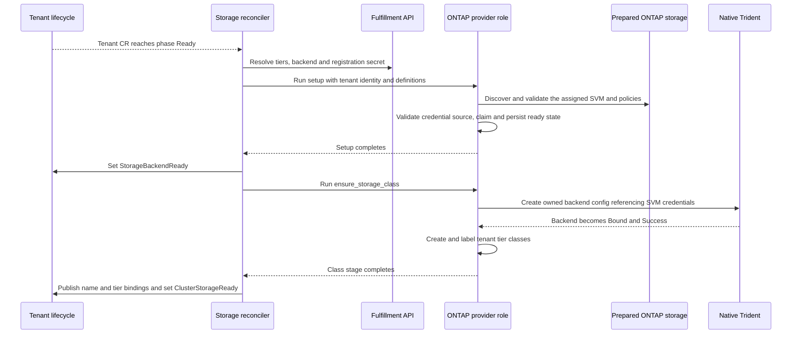

# NetApp preview: configuration and tenant lifecycle

| Field | Value |
|---|---|
| Author(s) | Zoltan Szabo |
| Jira | [OSAC-5813](https://redhat.atlassian.net/browse/OSAC-5813) |
| PRD | [prd.md](prd.md) |
| Date | 2026-10-06 |
| Last updated | 2026-10-08 |
| Status | Draft — dedicated prepared-SVM proposal; team agreement pending |

# 1. Overview

Reuse StorageBackend, StorageTier and the two Tenant storage stages to adopt a
dedicated, administrator-prepared ONTAP SVM. An ONTAP AAP role validates/claims
prepared storage and creates native Trident backend/tier bindings; it does not
create or delete SVMs/LIFs. See [PRD](prd.md) for product requirements.

This draft assumes acceptance of the prepared-SVM proposal. Credential and
manual-release conventions below are concrete proposals for review (§9).

# 2. Goals and Non-Goals

## 2.1 Goals

- Reuse common registration APIs and preserve existing provider behavior.
- Define the admin-preparation, operator and AAP handoffs.
- Record immutable ownership and completed stages so retry reuses the same
  assignment and deletion removes only OSAC-owned configuration.

## 2.2 Non-Goals

- Generic VM/Volume lifecycle, owned by [OSAC-6037](https://redhat.atlassian.net/browse/OSAC-6037); independent VaaS/dynamic attachment is separate stretch work.
- Driver installation automation, OSAC CSI changes, Enclave, CaaS/BMaaS, fabric zoning or HBA setup.
- Automatic SVM/LIF/account/policy provisioning or deletion, free-SVM allocation,
  automated sanitization and new credential-rotation automation.
- Multi-backend/cluster preview profiles and other transports.

# 3. Motivation / Background

Backend/tier registration and storage reconciliation exist, but there is no
ONTAP provider role. Dedicated prepared SVMs move topology, address allocation
and array-account/policy creation to infrastructure administrators. OSAC needs
management discovery, a protected assignment/credential handoff and native
backend/classes, rather than a physical provisioning recipe.

# 4. Design

## 4.1 Architecture

| Owner | Responsibility / missing work |
|---|---|
| Configuration owner | ONTAP registration probe; typed tier QoS; UI/CLI support; operator-to-AAP QoS/encryption mapping; API storage-status projection |
| Onboarding owner | ONTAP AAP role; prepared-SVM discovery/claim; native backend/classes; persisted progress, readiness and guarded teardown |
| Cloud Infrastructure Admin / QE | Manual array/FC/native-driver preparation, protected SVM credentials/policies, tested-version documentation and joint VM acceptance |

Registration and tenant creation are independent activities. The following
phases define their handoff; the diagram covers only the later onboarding.

### 4.1.1 Before deployment: infrastructure preparation

The Cloud Infrastructure Admin prepares one connected OpenShift Virtualization
cluster with supported FC access on every worker eligible for VMs or CDI imports:
HBAs, fabric paths/zoning and multipath. Guests receive virtual disks. The admin
installs a complete native Trident deployment, including CRDs and OpenShift
permissions, and documents the tested version/namespace. Existing bootstrap
storage starts OSAC; it cannot depend on tenant classes created afterward.

The admin supplies cluster-management HTTPS reachability/trust and a discovery
account allowed to read intended SVMs, management/FC interfaces, workload
volumes/LUNs and QoS policies. SVM/LIF/account/policy creation or deletion
privileges are unnecessary for that account. ONTAP management networking is
provider infrastructure; it adds no OSAC Subnet/ExternalIP or VM attachment API.

### 4.1.2 Register backend and tiers

1. The Cloud Provider Admin creates a protected Fulfillment VALUE password
   Secret in the backend's provider scope, then submits provider `ontap`, cluster
   endpoint and credentials through the existing private API/CLI/UI (§4.3).
2. Fulfillment validates credentials and read-only management/discovery access.
   Failure returns a sanitized error; success persists READY and returns the
   backend ID. No tenant assignment, SVM, native backend or StorageClass is created.
3. The admin registers BLOCK tiers referencing that ID, with optional native
   IOPS ceilings and the existing encryption setting (§4.2).

A registered backend confirms management access, not FC I/O or prepared tenant
storage. Tiers are catalog definitions until their tenant bindings are ready.

### 4.1.3 Before tenant creation: prepare its dedicated SVM

The Cloud Provider Admin chooses the planned tenant metadata name and shares
it, the returned backend ID and tier definitions with the infrastructure admin.
The infrastructure admin uses §4.2's convention to prepare:

1. One dedicated SVM, usable array capacity and no previous workload data or
   conflicting assignment. Root/configuration volumes are distinguished from
   tenant workload volumes during validation.
2. A separate reachable management LIF allowing HTTPS; `default-management` is
   ONTAP's built-in service policy for management traffic, not an account role.
   An equivalent HTTPS-capable policy is acceptable. Enable FCP and prepare
   SVM-scoped FC target LIFs/WWPNs and zoning. Physical ports may be shared;
   logical FC LIFs belong to their SVM. No separate IP data LIF is needed for FC.
3. An SVM-scoped account with native Trident's required permissions, plus the
   protected credential Secret and full assignment metadata. Discovery cannot
   recover an account password.
4. For each capped tier, an SVM-owned, non-shared QoS policy matching its ceiling;
   prepare the required volume-encryption capability for encrypted tiers.
   QoS policy creation requires appropriate cluster-administrator privileges.
   [ONTAP QoS creation](https://docs.netapp.com/us-en/ontap-cli-9171/qos-policy-group-create.html).

SVM accounts/native policies are administrator-prepared in this proposed
baseline. OSAC does not choose an arbitrary free SVM. Another tenant needs its
own preparation; missing prerequisites leave storage unavailable.

### 4.1.4 Create tenant and adopt storage

Normal tenant creation produces a Tenant CR. Its core lifecycle reaching
`phase=Ready` triggers the existing storage reconciler; this does not yet mean
its storage is ready.



Stage 1 resolves the exact SVM name, checks its UUID, management/FCP configuration,
prepared policy values, credential authorization and absence of unclaimed workload
data, then claims it for the current Tenant CR UID (§4.6). Stage 2 creates native
backend/classes (§5). The operator polls jobs and observes configuration/classes;
its existing reconciliation retries corrected preparation and completed stages.
No ready binding is published before native backend/class success.

The resulting `{name, tier}` bindings feed the shared VM path. A Tenant User
selects a tier through normal OSAC VM creation; OSAC-6037 owns Volume/PVC/DataVolume
identity, provisioning and deletion. Joint acceptance verifies actual FC VM I/O.

### 4.1.5 Delete tenant and retain prepared infrastructure

Shared workload/data guards run first. OSAC deletes its classes and native
backend configuration, waits for Trident cleanup and removes departing OSAC
access. It preserves the prepared SVM, LIFs, account, native policies and source
credential Secret, recording the assignment as retained. Failed cleanup blocks
completion; another tenant's bindings remain unchanged.

Before reuse, the infrastructure admin verifies data cleanup and revokes/replaces
old account access, then explicitly prepares a new credential generation.
OSAC checks identity/dependencies and the protected handoff; it cannot attest to
array sanitization merely from names. The manual-release proposal is in §4.6.

## 4.2 Data Model / Schema Changes

StorageBackendSpec stays unchanged: `provider`, `description`, `endpoint` and
`credentials`. No `spec.ontap` fields, topology recipe, new table or CRD is needed.
Tenant creation input also stays unchanged. The backend ID plus planned tenant
name identifies prepared storage; protected metadata confirms ownership.

Add a typed optional tier extension following `IdentityProviderSpec.oneof config`:

```protobuf
// Add to private BackendAssociation; existing fields 1–4 stay unchanged.
oneof provider_qos {
  OntapAssociationConfig ontap = 5;
}
message OntapAssociationConfig {
  option (cleanapi.message).private = true;
  int64 max_iops = 1 [(buf.validate.field).int64.gte = 0];
}

// Add to the existing private TenantConditionType enum.
TENANT_CONDITION_TYPE_STORAGE_BACKEND_READY = 3;
TENANT_CONDITION_TYPE_CLUSTER_STORAGE_READY = 4;
```

The oneof is not a nested JSON object: input is `spec.backends[].ontap.maxIops`.
Positive values cap each volume; zero/unset adds no cap. Public tier shape stays
unchanged. Existing read/write bandwidth fields must be zero for ONTAP; they are
not equivalent to a combined IOPS ceiling. `encryption_enabled` remains generic.
Native pools reference the matching pre-created policy and encryption defaults;
unsupported/mismatched preparation fails. [Native pool settings](https://docs.netapp.com/us-en/trident-2510/trident-use/ontap-san-examples.html).

### Assignment and credential sources

Names are computable before Tenant CR creation:

```text
assignment_key = lowercase_hex(sha256(backend_id + "|" + tenant_name))[:16]
tier_key = lowercase_hex(sha256(tier_name))[:16]
SVM = osac-<assignment_key>-svm
credential Secret = osac-<assignment_key>-credentials
capped-tier policy = osac-<assignment_key>-<tier_key>-qos
```

Tenant name is the immutable metadata name, not its display name. The short key
is a name component, not ownership proof. A protected Kubernetes Secret in the
configured native Trident namespace holds `username`/`password` and annotations:

| Annotation | Value |
|---|---|
| `osac.openshift.io/storage-backend` | Full Fulfillment backend ID |
| `osac.openshift.io/tenant` | Planned tenant name |
| `osac.openshift.io/storage-resource-id` | Discovered SVM UUID |
| `osac.openshift.io/storage-assignment-state` | Initially `available`; OSAC writes `claimed`, then `retained` |
| `osac.openshift.io/storage-tenant-uid` | OSAC writes the full Tenant CR UID when claiming |

This administrator source is separate from the Fulfillment registration password
Secret. It is not generated by OSAC and has no Tenant garbage-collection owner
reference. AAP reads it through the existing privileged cluster connection; native
Trident references it directly. Tenants cannot read or change the handoff.

### 4.2.1 Worked example: one array, two tenants

All values are illustrative, not lab inventory. The Cloud Provider Admin uses
existing backend input; no physical placement fields are submitted:

```json
{
  "metadata": {"name": "netapp-fc"},
  "spec": {
    "provider": "ontap",
    "endpoint": "https://ontap.example.invalid",
    "credentials": {
      "username": "storage-discovery",
      "passwordSecret": {"id": "registration-secret-id"}
    }
  }
}
```

Suppose registration returns `backend-id`. The admin registers `fast`:

```json
{
  "metadata": {"name": "fast"},
  "spec": {
    "protocol": "STORAGE_PROTOCOL_BLOCK",
    "backends": [{
      "backendId": "backend-id",
      "encryptionEnabled": false,
      "ontap": {"maxIops": "5000"}
    }]
  }
}
```

`maxIops` is a ProtoJSON int64 string; IC-4 converts it to a numeric Ansible value.
Before normal tenant creation, infrastructure administrators prepare:

| Resource | tenant-a | tenant-b |
|---|---|---|
| Assignment key | `79457936f209a67b` | `1dfcf6434a6218ff` |
| SVM | `osac-79457936f209a67b-svm` | `osac-1dfcf6434a6218ff-svm` |
| Management LIF address | `198.51.100.100` | `198.51.100.101` |
| Credential Secret | `osac-79457936f209a67b-credentials` | `osac-1dfcf6434a6218ff-credentials` |
| Non-shared 5,000 IOPS policy | `osac-79457936f209a67b-115dc3606fbf8691-qos` | `osac-1dfcf6434a6218ff-115dc3606fbf8691-qos` |

Each Secret carries its full backend/name/SVM UUID and `available` state.
Onboarding A receives IC-4 input, discovers A's management endpoint, claims its
Secret and configures native Trident using A's SVM account. B repeats this with
its own prepared resources. The common backend endpoint/credential is used for
discovery, while native volume operations use separate SVM endpoints/accounts.
Offboarding A removes only A's OSAC configuration and retains its prepared
resources; B remains usable. No tenant supplies topology or array credentials.

## 4.3 API Changes

Keep existing private Create/Get/List/Update methods. Backend credentials retain
exactly-one password/password_secret validation. For ONTAP, Create performs a
read-only probe before persisting READY: verified HTTPS, no redirects, a proposed
10-second total deadline, cluster version and bounded reads of the discovery
surfaces in §4.1.1. Empty results are valid before tenant preparation; forbidden
required reads are not. Repeat after a credential Update, validating merged state.
Return sanitized `InvalidArgument` for invalid input/401, `FailedPrecondition`
for missing discovery permissions/403, `Unavailable` for connectivity/TLS and
`DeadlineExceeded` for timeout. No array mutation is part of registration.

Preserve provider immutability. For the proposed preview, reject ONTAP endpoint
changes and tier backend/QoS/encryption mutations requiring rebinding; description
and backend credentials remain updateable. Replacement follows existing
resource dependency guards. Existing providers retain their behavior.

Tier validation looks up its backend: one existing association, BLOCK, nonnegative
native cap and zero generic bandwidth. An ONTAP QoS branch on another provider
returns `InvalidArgument`; an absent backend returns `NotFound`. Unset native
QoS is valid. Proto validation handles local constraints; provider agreement
needs the API lookup. No Tenant SVM/account parameters or new Secret API type.

## 4.4 Scalability and Performance

One prepared SVM and OSAC configuration/native backend per tenant; one virtual
pool/class per tier. Capacity, SVM/FC limits and preparation remain infrastructure
responsibilities. Backend/credential API reads stay deduplicated; exact-name/UUID
provider queries avoid whole-array scans. Retained assignment records are small
and cannot be discarded while their infrastructure can be reassigned.

## 4.5 Security Considerations

The discovery account remains read-only. The administrator-supplied SVM account
serves native volume operations; cluster credentials are never its fallback.
Use verified trust, existing secret resolution, `no_log` and fact clearing.
Do not return credentials in AAP results, API status or tenant namespaces.
FC access uses authorized igroups/LUN mappings and zoning, not export policies.

## 4.6 Failure Handling and Recovery

Persist `ontap-tenant-<assignment_key>` in the Tenant CR's configuration namespace,
with existing discovery labels, full Tenant CR UID/backend/SVM UUID, source Secret
UID, endpoints/WWPNs, policy names, owned native resource IDs and phase. Do not
store another copy of the SVM password. Record intended work before mutation,
then completed identities after readback. The operator checks phase/UID, not
Secret presence, before setting storage readiness.

Claim source metadata with Kubernetes resource-version checks; conflicts retry
after reread. A retry with the same UID resumes completed work. A different UID,
SVM UUID, backend or stale credential generation is rejected. If claiming succeeds
but the job stops before recording completion, the same UID can recover from the
validated source claim. Prepared resources are not OSAC deletion targets.

| Failure | Observable result / recovery |
|---|---|
| Backend/tier API or registration credential unavailable | Storage stays false; no default-class fallback; retry resolution |
| Missing SVM, source Secret, management/FCP configuration or policy | `OntapPreparationMissing` / `OntapConfigurationInvalid`; no automatic infrastructure creation; admin corrects preparation |
| SVM account unusable or discovery permission missing | `OntapCredentialInvalid` / `OntapPermissionDenied`; no cluster-account substitution |
| SVM UUID/assignment mismatch or unclaimed workload data | `OntapOwnershipConflict` / `OntapDependenciesRemain`; stop without mutation |
| Native driver missing or bind deadline exceeded | `OntapDriverUnavailable` / `OntapBackendNotReady`; no ready class publication |
| Cleanup failure or active/unverifiable dependencies | `OntapCleanupFailed` / `OntapDependenciesRemain`; retain state/source credential and finalizer |

Setup uses `validating`, then `ready` only after preparation/claim readback.
Native class setup waits a proposed 300 seconds for TBC Bound/Success; timeout
fails the stage, not the Tenant's completed identity onboarding. Restart/retry
reuses recorded resources. Runtime fabric failures use PVC/Trident events and
recorded WWPNs for manual correction; control-plane readiness is not FC validation.

Offboarding order: verify shared/native/array data guards → delete owned classes
→ delete TBC and wait for native backend disappearance → record `retained` on
assignment/source → clear storage finalizers after readback. Propagate provider
errors currently swallowed by shared teardown; reuse `BlockDeletionOnFailure=true`.
Delete jobs require the original Tenant UID and inspect partial state even if
setup never became ready. Never delete prepared SVM/LIF/account/policy/source.

Retained assignment records survive Tenant deletion, without a Tenant garbage-
collection owner reference. Recreating the same name cannot adopt the old claim.
Proposed manual release: after offboarding and administrator-verified data/access
cleanup, replace the credential Secret with a new Kubernetes UID, matching full
assignment metadata and `available` state without the old claim. A new onboarding
may replace a retained record only after verifying the new source generation,
no active native dependencies and no previous workload data. Deleting the old
Secret alone is not release. OSAC does not automate sanitization or credential
rotation; trusted infrastructure admins perform those operations. Review §9.4.

## 4.7 RBAC / Tenancy

Keep provider-only registration and tenant-authorized consumption. OSAC-created
classes/backend configuration carry tenant/owner-reference annotations, existing
discovery labels and full UID ownership. Prepared sources/retained records carry
tenant metadata but no garbage-collection relationship to the Tenant. AAP needs
protected source-Secret access in the configured native-driver namespace.
Selectors and shared-worker igroups do not enforce tenant authorization: verify
API/admission prevents selection of another tenant's class (§9.3).

## 4.8 Extensibility / Future-Proofing

Backend registration stays generic. Typed tier oneof branches enforce at-most-one
provider extension; the API verifies its backend match. Generic AAP QoS maps keep
the dispatcher provider-independent. Prepared-resource discovery and credential
conventions belong to the ONTAP role; no generic allocator/driver framework.

# 5. Interface Changes

R1–R5 are local anchors to the unnumbered [PRD](prd.md), shared by the [test plan](testplan.md).

| Reference | PRD requirement / source |
|---|---|
| R1 | Backend registration/actionable access errors — In Scope; provider-admin story |
| R2 | Native block tiers/performance — In Scope; provider-admin story |
| R3 | Isolated prepared-SVM adoption, readiness/retry — In Scope; Required verification |
| R4 | Guarded offboarding, retention and safe reuse — In Scope; Required verification |
| R5 | Ready tier handoff/joint VM acceptance — tenant story; Dependencies |

## IC-1: ONTAP backend registration

**Requirements:** R1, R3. Existing StorageBackend fields and protected password
references; add the read-only management/discovery probe (§4.3). No ONTAP topology
branch. Registration and onboarding remain separate operations.

## IC-2: ONTAP tier association

**Requirements:** R2, R3. Private typed `BackendAssociation.provider_qos` oneof,
ONTAP cap and provider/protocol validation (§4.2–4.3). Preserve generic encryption.

## IC-3: Administration UI and CLI

**Requirements:** R1, R2. Add ONTAP provider selection and native tier IOPS input;
reuse endpoint/credentials, with no placement form. Show sanitized access/preparation
errors and storage readiness. Advance the UI's selected API baseline deliberately,
regenerate bindings and retain existing-provider payload behavior.

## IC-4: Operator → AAP request

**Requirements:** R2, R3. Keep common BackendConnection unchanged. Add optional
generic `provider_config` to TierQosLimits plus tier `encryption_enabled`.
Map the typed ONTAP cap explicitly to numeric `qos_limits.provider_config.max_iops`;
serializers/dispatcher pass it through. No reflection or vendor-named AAP wrapper.

```yaml
osac_job_vars:
  resource:
    metadata: {name: tenant-a, namespace: osac-system, uid: tenant-uid}
  storage_tier_definitions:
    - name: fast
      protocol: block
      provider: ontap
      backend_id: backend-id
      encryption_enabled: false
      qos_limits:
        static_limits: {max_reads_bw_mbps: 0, max_writes_bw_mbps: 0}
        provider_config: {max_iops: 5000}
  storage_backend_connections:
    backend-id:
      endpoint: https://ontap.example.invalid
      username: storage-discovery
      password: "<resolved only at runtime>"
```

Forward only referenced connections. The role calculates the assignment and
reads/discovers prepared metadata; no physical recipe or SVM password is added
to extra_vars. Role advertises block/VMaaS. Existing role configuration supplies
`ontap_storage_trident_namespace` (proposed default `trident`). In this preview
profile set `csi_driver_install_enabled=false` and
`storage_provider_csi_backends_enabled=false`; check the full native deployment
rather than installing OSAC's raw controller. Preserve existing provider paths.
All setup/delete jobs carry metadata.name/namespace/uid.

## IC-5: AAP state and consumption output

**Requirements:** R3, R4, R5. Config/assignment Secret follows §4.6; safe AAP
results contain identities/endpoints/WWPNs and source Secret reference, not passwords.

TBC `ontap-<assignment_key>` in the configured native namespace references the
prepared credential Secret: `storageDriverName=ontap-san`, `sanType=fcp`, discovered
`svm`/SVM `managementLIF`, `useREST=true`, `deletionPolicy=delete`. Each tier virtual
pool has `osacOwner`, `osacBackend`, `osacTier` labels and matching QoS/encryption
defaults. Omit IP `dataLIF`. [Native FC settings](https://docs.netapp.com/us-en/trident-2510/trident-use/ontap-san-examples.html),
[credential references and backend lifecycle](https://docs.netapp.com/us-en/trident-2510/trident-use/backend-kubectl.html).

Class `ontap-<assignment_key>-<tier_key>` uses `csi.trident.netapp.io`,
Delete/Immediate and the matching owner/backend/tier selector. Full tenant UID
belongs in annotations/state; the selector naming key alone is not authorization.
Existing labels/results populate `Tenant.status.storageClasses=[{name, tier}]`,
`storage_provider_storage_class_names` and `tenant_storage_classes`. OSAC-6037 owns
PVC/DataVolume modes and any Volume API adaptation; this output is not proof of
completed consumption integration.

## IC-6: Readiness, retries and teardown

**Requirements:** R3, R4, R5. Reuse the four existing provider actions and storage
conditions/jobs/finalizers, with prepared-resource ownership/progress checks.
The actions are `setup`, `ensure_storage_class`, `teardown_cluster_storage` and
`teardown_backend`; setup validates/adopts, and teardown preserves prepared array
resources while removing OSAC configuration.
Add the private API condition values in §4.2 and project both operator storage
conditions, reasons and messages through `TenantStatus.conditions` to UI/CLI/API.
IDP synchronization stays distinct from storage readiness. Missing AAP/catalog/
credential/UID information blocks ONTAP teardown rather than a legacy skip.

# 6. Alternatives Considered

| Decision | Alternative / tradeoff |
|---|---|
| Dedicated prepared SVM | Automatic creation needs topology/addressing and privileged array mutations. An arbitrary free pool adds allocation/release coordination. Both exceed the proposed convention-based preview model. |
| Administrator-supplied credentials/policies | OSAC-generated accounts/policies reduce admin steps but need creation privileges and revocation ownership; not assumed by the prepared-SVM baseline (§9.4). |
| Native Trident | OSAC CSI conflicts with the preview profile. Direct allocation/custom PVC adoption adds a shared binding contract; agree adaptations with OSAC-6037. |
| Typed tier oneof | Bare optional branches permit conflicts; Struct/Any weaken generated validation/forms or add unpacking. Typed branches with generic AAP pass-through preserve extensibility. |
| Retained assignment record | Secret name/presence alone loses ownership on recreation. Durable full identity/source-generation checks add small state but allow safe retry and explicit manual release. |
| Numeric IOPS ceiling | Translating read/write bandwidth changes semantics; referencing arbitrary policy names hides cap meaning. A typed cap plus prepared matching non-shared policy is explicit. |

# 7. Observability and Monitoring

Reuse Tenant conditions, AAP history and Kubernetes/Trident events. Report
provider/tenant/backend/stage/reason and retained infrastructure; redact passwords.
No new metrics or continuous fabric-health monitor. API status projection is
required work, not implied by existing IDP status.

# 8. Impact and Compatibility

Deploy matched proto/API/operator/AAP/UI contracts before admitting ONTAP; existing
providers need no migration. Preserve field tags and public tier output. Downgrade
requires guarded NetApp cleanup and accounting for retained claims; no supported
in-place OSAC upgrade is introduced. Document preparation/naming, native driver
version/trust, source credentials, native policy mapping and manual release.
No installer value/schema or Enclave change; configure existing AAP provider
settings through its established path.

[OSAC-6037](https://redhat.atlassian.net/browse/OSAC-6037) owns shared disk identity,
provisioning and cleanup. The [test plan](testplan.md) separates DEV boundary
coverage from QE two-tenant FC VM/retention acceptance. Proposed live harnesses
and unverified lab permissions remain execution gaps.

# 9. Open Questions

## 9.1 Does the shared VM path accept these native bindings unchanged?

- **Owner:** Configuration/onboarding owners and OSAC-6037 workstream.
- **Impact:** Confirm `{name, tier}` handoff and any provider-specific adaptation;
  no generic VM lifecycle work is assigned to onboarding. PRD OQ-1.

## 9.2 Does the target lab meet the prepared-SVM/FC contract?

- **Owner:** QE / infrastructure owners and infrastructure/partner workstream.
- **Impact:** Verify ONTAP family/version, discovery/SVM account permissions,
  management trust, native QoS/encryption, two prepared SVMs, worker FC paths,
  zoning and tested native Trident version. Access handoff is not FC acceptance.
  `useREST=true` must be qualified on the target version. PRD OQ-2/OQ-4.

## 9.3 Does shared-cluster authorization prevent cross-tenant class selection?

- **Owner:** Storage Working Group / onboarding and shared-consumption owners.
- **Impact:** Verify API/admission guards for native PVC access; selector/igroup
  separation alone is insufficient. Missing enforcement needs an owner. PRD OQ-3.

## 9.4 Are the credential and manual-release conventions accepted?

- **Owner:** Storage Working Group / Core-secrets and infrastructure owners.
- **Impact:** Agree the protected source Secret, retained record and new-generation
  release checks. Administrator-supplied credentials/native policies are the stated
  draft baseline, not an answered credential decision. Changing to OSAC-created
  accounts/policies changes privileges and teardown ownership. PRD OQ-3/OQ-4.

---

## Provenance

Authored: revise @ design 0.11.3 - 2bd6607, workspace osac-5813-netapp-integration @ c8d0d8890
Phases: draft, revise, revise, revise, revise, revise

<!-- ai-workflow-provenance:{"schema_version":1,"provenance_kind":"session","workflow":"design","workflow_version":"0.11.3","ai_workflows":"2bd6607","source_repo":"c8d0d8890","source_repo_branch":"osac-5813-netapp-integration","commits_behind_main":0,"commits_ahead_main":0,"main_ref":"main","phases":["draft","revise","revise","revise","revise","revise"],"authoring_modes":["skill"],"context_changed":false,"origin_untracked":false} -->
