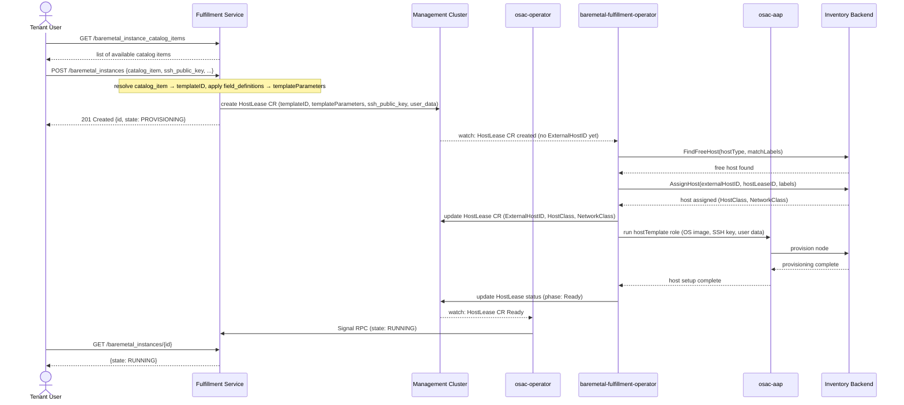

# BareMetal Instance API

## Summary

This enhancement introduces `BareMetalInstance` and `BareMetalInstanceCatalogItem` resources to the OSAC fulfillment-service public API, enabling tenants to provision and manage physical bare metal servers through a self-service interface. Catalog items are provider-managed entries that expose available hardware profiles, OS base images, and network configurations to tenants; each is backed by a `BareMetalInstanceTemplate`. The design adopts a pluggable provider architecture — implemented in a dedicated baremetal fulfillment component — so that future bare metal backends can be integrated without breaking the API. This EP is scoped to the fulfillment-service API layer; operator, provisioning, UX, and E2E concerns are tracked as companion work items under OSAC-1118.

## Motivation

OSAC currently provides no fulfillment path for workloads requiring direct hardware access. Tenants running GPU-intensive, high-performance networking, or latency-sensitive workloads have no self-service mechanism to request and manage bare metal nodes through OSAC.

### User Stories

* As a **Tenant User**, I want to browse available `BareMetalInstanceCatalogItem` objects so that I can select the one that matches my workload requirements.
* As a **Tenant User**, I want to provision a bare metal server by specifying a `BareMetalInstanceCatalogItem` so that I can run workloads that require direct hardware access without manual coordination with the cloud provider.
* As a **Tenant User**, I want to monitor the lifecycle state of my bare metal server (provisioning, running, failed) so that I can take corrective action if provisioning fails.
* As a **Tenant User**, I want to control the run strategy (power on/off) of my bare metal server so that I can manage its operational state without deprovisioning it.
* As a **Tenant User**, I want to restart my bare metal server so that I can perform maintenance without deprovisioning it.
* As a **Tenant User**, I want to deprovision my bare metal server when my workload is complete so that resources are released.
* As a **Cloud Provider Admin**, I want to define and publish `BareMetalInstanceCatalogItem` objects so that I can control which hardware profiles and OS images are available to tenants.
* As a **Tenant Admin**, I want to create organization-specific `BareMetalInstanceCatalogItem` objects from available templates so that I can offer tenant-specific bare metal configurations to users in my organization.
* As a **Cloud Infrastructure Admin**, I want the OSAC stack to integrate with BCM (NVIDIA Base Command Manager) so that bare metal provisioning is automated through the existing control plane.

### Goals

* Provide a self-service API for tenants to create `BareMetalInstance` resources referencing a `BareMetalInstanceCatalogItem`.
* Define `BareMetalInstanceTemplate` as a resource managed by Cloud Provider Admins through the private API and readable by tenants through the public API (List/Get); `BareMetalInstanceCatalogItem` as a catalog resource where Cloud Provider Admins publish global entries via the private API and Tenant Admins create tenant-scoped ones via the public API; publishing control and tenant scoping are enforced by the server.
* Maintain API consistency with `ComputeInstance` where possible — same resource shape, service structure, template and catalog item patterns, run strategy and restart signal mechanism, and authorization model.
* Expose the API through both gRPC and the existing REST gateway.

### Non-Goals

* Integration with OSAC networking resources (`VirtualNetwork`, `Subnet`, `SecurityGroup`) — deferred to a future enhancement; in this initial phase, network configuration is fixed by the Cloud Provider Admin as part of the `BareMetalInstanceCatalogItem` and tenants have no mechanism to configure networking at provision time. A dedicated networking enhancement will enable tenants to create their own `Subnet` and attach it to a `BareMetalInstance`.
* Custom hardware profile or OS image selection by tenants at provision time — fixed by the catalog item. Tenants requiring a different profile must request the Cloud Provider Admin to publish a new catalog item.
* AAP playbook, baremetal fulfillment component, UI/UX, and E2E test implementation — covered in companion work.
* Support for multiple bare metal backends in this initial release — the architecture is designed for future extensibility.
* Quota enforcement for `BareMetalInstance` — deferred to a future enhancement.

## Proposal

The proposal introduces three new resource types to the fulfillment-service public API:

**`BareMetalInstanceTemplate`** defines a bare metal hardware profile (host type, OS image, network configuration). Cloud Provider Admins create and manage templates via the private API; tenants can discover available templates via the public API (List/Get only). osac-aap is used for the actual host-level provisioning at runtime, not for template management.

**`BareMetalInstanceCatalogItem`** is a catalog entry that presents an available bare metal configuration to tenants. Cloud Provider Admins publish global catalog items; Tenant Admins can additionally create tenant-scoped catalog items through the public API, referencing available templates. The `published` flag controls visibility and an optional `tenant` field enables scoping to a specific tenant; unpublished or out-of-scope catalog items are invisible to tenant List/Get calls. `FieldDefinition` entries on the catalog item govern which spec fields tenants may override and apply defaults for the rest.

**`BareMetalInstance`** is a tenant-created resource representing a provisioned bare metal server. Its `spec` references a catalog item via `catalog_item` and carries provisioning parameters (SSH public key, user data, run strategy, restart signal). Its `status` exposes the lifecycle state and conditions.

Provisioning is driven by a chain of components: the fulfillment service creates a `HostLease` CR in the management cluster when a `BareMetalInstance` is created. The baremetal fulfillment operator picks up the `HostLease`, finds and assigns a free host from the inventory backend, and triggers `osac-aap` for host-level setup (OS image, SSH key, user data). The osac-operator watches `HostLease` CRs for status changes and pushes updates back to the fulfillment service via the `Signal` RPC. `HostLease` is an internal implementation detail; tenants never interact with it directly.

### Workflow Description

**Actors:**
- **Cloud Provider Admin** — creates and manages `BareMetalInstanceTemplate` objects via the private API and publishes them as global `BareMetalInstanceCatalogItem` entries via the private API.
- **Tenant Admin** — creates tenant-scoped `BareMetalInstanceCatalogItem` entries via the public API, referencing available templates.
- **Tenant User** — creates and manages `BareMetalInstance` resources via the public API.
- **Fulfillment Service** — handles `BareMetalInstance` CRUD and creates `HostLease` CRs directly in the management cluster.
- **osac-operator** — watches `HostLease` CRs for status changes and pushes them to the fulfillment service via the `Signal` RPC; does not create any CRs in this flow.
- **baremetal-fulfillment-operator** — reconciles `HostLease` CRs: finds and assigns a free host from the inventory backend, then triggers `osac-aap` for host-level provisioning.
- **osac-aap** — executes the provisioning and deprovisioning Ansible roles (OS image, SSH key, user data); triggered by the baremetal-fulfillment-operator.
- **Inventory Backend** — the bare metal inventory used to find and assign free hosts (e.g. OpenStack Ironic or BCM).

#### Provisioning

1. The Cloud Provider Admin creates `BareMetalInstanceTemplate` objects via the private API and publishes them as `BareMetalInstanceCatalogItem` entries via the private API, setting `published: true`.
2. The Tenant User lists available catalog items:
   ```
   GET /api/fulfillment/v1/baremetal_instance_catalog_items
   ```
3. The Tenant User creates a `BareMetalInstance` referencing the desired catalog item:
   ```
   POST /api/fulfillment/v1/baremetal_instances
   ```
4. The fulfillment service resolves the catalog item to a `templateID` and derives `templateParameters` from the `field_definitions`, then creates a `HostLease` CR in the management cluster with those values plus `ssh_public_key` and `user_data`; `BareMetalInstance.status.state` is set to `BARE_METAL_INSTANCE_STATE_PROVISIONING`.
5. The baremetal-fulfillment-operator picks up the `HostLease` and queries the inventory backend to find and assign a free host matching the requested host type and selector.
6. The baremetal-fulfillment-operator triggers `osac-aap` to run the host-level provisioning template (OS image, SSH key, user data) and updates the `HostLease` status on completion.
7. The osac-operator watches the `HostLease` CR and pushes status updates to the fulfillment service via the `Signal` RPC; the fulfillment service reflects this in `BareMetalInstance.status`.
8. The Tenant User polls until `status.state` is `BARE_METAL_INSTANCE_STATE_RUNNING`:
   ```
   GET /api/fulfillment/v1/baremetal_instances/{id}
   ```

#### Failure Handling

If any step in the provisioning chain fails (playbook error, BCM API failure, `HostLease` stuck), the osac-operator sets `BareMetalInstance.status.state` to `BARE_METAL_INSTANCE_STATE_FAILED` via the `Signal` RPC. The tenant can inspect the `conditions` field for details. To retry, the tenant deletes and recreates the `BareMetalInstance`; note that recreating may result in a different physical host being assigned from the inventory.

#### Deprovisioning

1. The Tenant User deletes the instance:
   ```
   DELETE /api/fulfillment/v1/baremetal_instances/{id}
   ```
2. The fulfillment service deletes the `HostLease` CR; `BareMetalInstance.status.state` transitions to `BARE_METAL_INSTANCE_STATE_DELETING`.
3. The baremetal-fulfillment-operator reconciles the `HostLease` deletion: triggers `osac-aap` for the host-level deprovisioning template, then unassigns the host from the inventory backend.
4. The osac-operator watches the `HostLease` CR deletion and pushes final status via the `Signal` RPC.
5. The `BareMetalInstance` resource is removed once deprovisioning completes.

#### Provisioning Sequence



### API Extensions

**New gRPC services (public API):**
- `BareMetalInstanceTemplates` — List/Get only (read-only for tenants; managed through the private API).
- `BareMetalInstanceCatalogItems` — full CRUD; Tenant Admins manage tenant-scoped entries, Tenant Users get read-only access to published items.
- `BareMetalInstances` — full CRUD for tenant-managed bare metal instances.

**New gRPC services (private API):**
- `BareMetalInstanceTemplates` (private) — full CRUD + `Signal` RPC.
- `BareMetalInstanceCatalogItems` (private) — full CRUD + `Signal` RPC.
- `BareMetalInstances` (private) — full CRUD + `Signal` RPC for `osac-operator` feedback.

**REST gateway routes (public — tenant-facing):**
- `GET    /api/fulfillment/v1/baremetal_instance_templates`
- `GET    /api/fulfillment/v1/baremetal_instance_templates/{id}`
- `GET    /api/fulfillment/v1/baremetal_instance_catalog_items`
- `GET    /api/fulfillment/v1/baremetal_instance_catalog_items/{id}`
- `POST   /api/fulfillment/v1/baremetal_instance_catalog_items`
- `PATCH  /api/fulfillment/v1/baremetal_instance_catalog_items/{object.id}`
- `DELETE /api/fulfillment/v1/baremetal_instance_catalog_items/{id}`
- `GET    /api/fulfillment/v1/baremetal_instances`
- `GET    /api/fulfillment/v1/baremetal_instances/{id}`
- `POST   /api/fulfillment/v1/baremetal_instances`
- `PATCH  /api/fulfillment/v1/baremetal_instances/{object.id}` — `{object.id}` is the gRPC-gateway convention for PATCH: the request body carries the full object and the ID is bound via `object.id`.
- `DELETE /api/fulfillment/v1/baremetal_instances/{id}`

**REST gateway routes (private — Cloud Provider Admin):**
- `GET    /api/private/v1/baremetal_instance_templates`
- `GET    /api/private/v1/baremetal_instance_templates/{id}`
- `POST   /api/private/v1/baremetal_instance_templates`
- `PATCH  /api/private/v1/baremetal_instance_templates/{object.id}`
- `DELETE /api/private/v1/baremetal_instance_templates/{id}`
- `GET    /api/private/v1/baremetal_instance_catalog_items`
- `GET    /api/private/v1/baremetal_instance_catalog_items/{id}`
- `POST   /api/private/v1/baremetal_instance_catalog_items`
- `PATCH  /api/private/v1/baremetal_instance_catalog_items/{object.id}`
- `DELETE /api/private/v1/baremetal_instance_catalog_items/{id}`

**PATCH semantics:** The `PATCH` endpoint supports partial updates to mutable fields only: `run_strategy` and `restart_requested_at`. The `catalog_item`, `ssh_public_key`, and `user_data` fields are immutable after creation; requests that attempt to modify them are rejected with `400 Bad Request`. A `FieldMask` is applied automatically from the fields present in the request body.

### Implementation Details/Notes/Constraints

#### Proto: BareMetalInstanceTemplate

Public and private types share the same structure; the private type is identical but lives in `osac/private/v1/`.

**Public** (`osac/public/v1/baremetal_instance_template_type.proto`):

```protobuf
message BareMetalInstanceTemplate {
  string id = 1;
  Metadata metadata = 2;

  // Human-friendly short description (CLI/UI single-line display).
  string title = 3;

  // Human-friendly long description in Markdown format.
  string description = 4;

  // Default spec values applied when creating a BareMetalInstance from this template.
  BareMetalInstanceTemplateSpecDefaults spec_defaults = 5;
}

// No overridable spec fields in this initial version; fields will be added in future
// enhancements as tenant-configurable options are introduced (e.g. networking integration).
message BareMetalInstanceTemplateSpecDefaults {}
```

#### Proto: BareMetalInstanceCatalogItem

Two variants — public type omits the `tenant` field (server-managed); private type includes it:

**Public** (`osac/public/v1/baremetal_instance_catalog_item_type.proto`):

```protobuf
message BareMetalInstanceCatalogItem {
  string id = 1;
  Metadata metadata = 2;

  // Human-friendly short description (CLI/UI single-line display).
  string title = 3;

  // Human-friendly long description in Markdown format.
  string description = 4;

  // Reference to the underlying BareMetalInstanceTemplate (private resource).
  string template = 5;

  // Whether this catalog item is visible to tenants. Only published items are
  // returned by tenant-facing List/Get calls.
  bool published = 6;

  // Field 7 is omitted: `tenant` is an internal field managed by the server,
  // not exposed through the public API. When a Tenant Admin creates a catalog
  // item via the public API, the server automatically scopes it to the caller's
  // tenant.

  // FieldDefinition controls which BareMetalInstanceSpec fields tenants may
  // set at provision time. Non-editable fields are always overridden by the
  // catalog default; editable fields are validated against the provided JSON
  // Schema and fall back to the default when not supplied by the tenant.
  // No overridable fields are defined in this initial version; entries will
  // be added in future enhancements (e.g. networking integration).
  repeated FieldDefinition field_definitions = 8;
}
```

**Private** (`osac/private/v1/baremetal_instance_catalog_item_type.proto`):

```protobuf
message BareMetalInstanceCatalogItem {
  string id = 1;
  Metadata metadata = 2;
  string title = 3;
  string description = 4;
  string template = 5;
  bool published = 6;

  // Tenant scope for this catalog item. Empty string means the item is global
  // and visible to all tenants.
  string tenant = 7;

  repeated FieldDefinition field_definitions = 8;
}
```

#### Proto: BareMetalInstance

```protobuf
message BareMetalInstance {
  string id = 1;
  Metadata metadata = 2;
  BareMetalInstanceSpec spec = 3;
  BareMetalInstanceStatus status = 4;
}

message BareMetalInstanceSpec {
  // Reference to the BareMetalInstanceCatalogItem. Required on create; immutable after creation.
  string catalog_item = 1;

  // SSH public key injected into the OS at provisioning time. Immutable after creation.
  // Must be a valid SSH public key in OpenSSH format (ssh-rsa, ssh-ed25519, etc.).
  // Invalid keys are rejected at create time with a 400 error.
  optional string ssh_public_key = 2;

  // User data (e.g. cloud-init). Passed to the OS at first boot. Immutable after creation.
  // Maximum size: 64 KB.
  optional string user_data = 3;

  // Run strategy controls the power state of the bare metal instance (on/off).
  // An enum is used rather than a boolean to leave room for future states (e.g. suspended backends).
  optional BareMetalInstanceRunStrategy run_strategy = 4;

  // RestartRequestedAt is a timestamp signal to request a power cycle.
  // Set to the current time to trigger an immediate restart.
  // The controller executes the restart if this timestamp is greater than status.last_restarted_at.
  optional google.protobuf.Timestamp restart_requested_at = 5;
}

message BareMetalInstanceStatus {
  BareMetalInstanceState state = 1;
  repeated BareMetalInstanceCondition conditions = 2;

  // LastRestartedAt records when the last restart was initiated by the controller.
  optional google.protobuf.Timestamp last_restarted_at = 3;
}

enum BareMetalInstanceRunStrategy {
  BARE_METAL_INSTANCE_RUN_STRATEGY_UNSPECIFIED = 0;

  // The instance is kept powered on.
  BARE_METAL_INSTANCE_RUN_STRATEGY_ALWAYS      = 1;

  // The instance is powered off.
  BARE_METAL_INSTANCE_RUN_STRATEGY_HALTED      = 2;
}

enum BareMetalInstanceState {
  BARE_METAL_INSTANCE_STATE_UNSPECIFIED  = 0;
  BARE_METAL_INSTANCE_STATE_PROVISIONING = 1;
  BARE_METAL_INSTANCE_STATE_RUNNING      = 2;
  BARE_METAL_INSTANCE_STATE_FAILED       = 3;
  BARE_METAL_INSTANCE_STATE_DELETING     = 4;
}

enum BareMetalInstanceConditionType {
  BARE_METAL_INSTANCE_CONDITION_TYPE_UNSPECIFIED           = 0;

  // Infrastructure has been allocated to this instance by the baremetal fulfillment component.
  BARE_METAL_INSTANCE_CONDITION_TYPE_PROVISIONED           = 1;

  // OS image and user configuration have been applied by the provisioning provider.
  BARE_METAL_INSTANCE_CONDITION_TYPE_CONFIGURATION_APPLIED = 2;

  // The machine is available and assigned to the tenant (HostLease active).
  // Does not indicate OS readiness — the tenant is responsible for OS-level checks.
  BARE_METAL_INSTANCE_CONDITION_TYPE_READY                 = 3;

  // A power cycle (restart) is currently in progress.
  BARE_METAL_INSTANCE_CONDITION_TYPE_RESTART_IN_PROGRESS   = 4;

  // A restart request has failed.
  BARE_METAL_INSTANCE_CONDITION_TYPE_RESTART_FAILED        = 5;

  // Configuration changes require a restart to take effect.
  BARE_METAL_INSTANCE_CONDITION_TYPE_RESTART_REQUIRED      = 6;
}
```

#### Alignment with ComputeInstance

Where possible, the BareMetalInstance API is consistent with ComputeInstance:
- `id` + `Metadata` + `spec` + `status` envelope.
- Condition shape: `ConditionStatus`, `last_transition_time`, `reason`, `message`.
- CRUD service shape and REST route pattern (`/api/fulfillment/v1/<resource>`).
- Private `Signal` RPC for `osac-operator` feedback loop.
- `run_strategy` and restart signal mechanism (`restart_requested_at`, `last_restarted_at`).
- `spec.catalog_item` referencing a `BareMetalInstanceCatalogItem` with `FieldDefinition`-based field control.
- `BareMetalInstanceTemplate` with `spec_defaults`; managed via private API, readable via public List/Get.

Fields specific to VMs (network attachments, image, cores, memory) are absent from `BareMetalInstance` in this initial version.

### Risks and Mitigations

**Risk:** Backend API changes break the provisioning path.
**Mitigation:** The provider abstraction in the baremetal fulfillment component isolates backend-specific code. Integration tests run against a BCM-compatible environment in CI.

**Risk:** Long provisioning times (bare metal typically takes 10–30 minutes) confuse tenants or expose timeout issues.
**Mitigation:** The `PROVISIONING` state and condition set give clear asynchronous progress signals. No API call blocks on physical provisioning; the osac-operator and baremetal fulfillment component reconcile asynchronously.

**Risk:** Tenant isolation errors — one tenant accesses or deprovisions another tenant's bare metal instance.
**Mitigation:** Follows the same OPA-based authorization model as `ComputeInstance`. Tenant scoping is enforced at the fulfillment-service layer via existing middleware.

**Risk:** Tenants provision unlimited bare metal instances, exhausting backend capacity.
**Mitigation:** Quota enforcement for `BareMetalInstance` is deferred to a future enhancement. Until quotas are implemented, capacity limits must be managed out-of-band by the Cloud Provider Admin.

**Risk:** Compromised backend credentials expose the bare metal backend to unauthorized access.
**Mitigation:** Credential storage and management for the baremetal backend are out of scope for this EP and will be defined in a dedicated security enhancement. The baremetal fulfillment component must not embed credentials in CRDs or API responses.

### Drawbacks

None identified.

## Alternatives (Not Implemented)

**Map `BareMetalInstance` to the existing `ComputeInstance` resource with a baremetal flag.** This avoids a new resource type but conflates VM and bare metal semantics, complicates catalog item definitions, and requires dispatching on a field value rather than resource type. A dedicated resource type provides cleaner separation of concerns and allows independent API evolution.

**Expose the bare metal backend API directly to tenants.** This bypasses OSAC entirely, eliminating tenant isolation, quota enforcement, and the pluggable backend architecture. Not viable for a multi-tenant cloud platform.

## Open Questions

1. ~~Should `BareMetalInstance` and `HostLease` be the same object, or remain distinct?~~ **Closed:** Distinct. The fulfillment service creates a `HostLease` as the internal backend CRD, but `HostLease` is also used by other workflows (cluster-as-a-service, agent provisioning) that bypass the fulfillment service entirely. Coupling the public API schema to `HostLease` would make future consolidation a breaking change.

## Test Plan

Test plan will be finalized during the implementation phase. Expected coverage:

- **Unit tests:** Proto field validation, state machine transitions, provider interface mocking.
- **Integration tests:** `BareMetalInstance` CRUD via gRPC, catalog item CRUD (public and private), `published` visibility enforcement, tenant-scoping enforcement (Tenant Admin creates scoped items; Cloud Provider Admin creates global items via private API), `FieldDefinition` application, Signal RPC feedback loop, OPA authorization enforcement, PATCH immutability enforcement.
- **E2E tests:** Full provisioning and deprovisioning workflow against BCM; CI pipeline configured to run E2E tests on merge.

Tricky areas: asynchronous provisioning lifecycle (tests must handle delays or mock the provider), `catalog_item` immutability enforcement after create, `published`/`tenant` visibility boundary checks, tenant isolation boundary checks, and failure-path recovery (FAILED state → delete → recreate).

## Graduation Criteria

Graduation criteria will be defined when targeting a release. Expected progression:

- **Dev Preview:** API available, BCM backend functional, basic CRUD working end-to-end.
- **Tech Preview:** E2E tests passing in CI, UX available, pluggable backend architecture validated with at least one additional backend stub.
- **GA:** Production deployment, full test coverage, support procedures operationally validated.

## Upgrade / Downgrade Strategy

This is a new API with no impact on existing resources. Downgrading requires deleting all `BareMetalInstance` and `BareMetalInstanceCatalogItem` resources and uninstalling the new CRDs from the management cluster before reverting the fulfillment-service image.

## Version Skew Strategy

The fulfillment-service, baremetal-fulfillment-operator, and osac-operator must be upgraded together. If the baremetal-fulfillment-operator is not running, `HostLease` CRs will not be reconciled and new `BareMetalInstance` create requests will remain in `PROVISIONING` indefinitely. If the osac-operator baremetal controller is not running, status updates will not propagate back to the fulfillment service.

## Support Procedures

> **Log hygiene:** Before sharing or inspecting logs, operators must verify that `ssh_public_key`, `user_data`, and backend credentials (inventory API tokens, AAP credentials) are redacted. These values must never appear in fulfillment-service or operator logs; if they do, treat it as a security incident and rotate the affected credentials immediately.

**Symptom:** `BareMetalInstance` stuck in `BARE_METAL_INSTANCE_STATE_PROVISIONING`.
**Diagnosis:** Check baremetal-fulfillment-operator logs for inventory or AAP errors. Check osac-aap job logs for playbook failures. Verify the `HostLease` CR exists and that `ExternalHostID` has been set (indicates host was found in inventory).
**Resolution:** If the host was allocated but provisioning failed, delete the `HostLease` CR manually and delete the `BareMetalInstance` to trigger a clean retry.

**Symptom:** All `BareMetalInstance` creations remain in `BARE_METAL_INSTANCE_STATE_PROVISIONING` with no `HostLease` created.
**Diagnosis:** The fulfillment service may not be able to reach the management cluster API. Check fulfillment-service logs for Kubernetes API errors.
**Resolution:** Verify management cluster connectivity and credentials used by the fulfillment service.

**Symptom:** All `BareMetalInstance` creations transition to `BARE_METAL_INSTANCE_STATE_FAILED`.
**Diagnosis:** Check baremetal-fulfillment-operator logs for inventory API or AAP errors. Validate inventory backend credentials, verify AAP availability, and confirm network connectivity.
**Resolution:** Rotate credentials if expired, resolve network connectivity issues, then retry by deleting the failed `BareMetalInstance` and recreating it.

**Symptom:** Create returns `404 Not Found` for the catalog item ID.
**Diagnosis:** The `BareMetalInstanceCatalogItem` does not exist, is not published, or is scoped to a different tenant.
**Resolution:** Cloud Provider Admin must create the catalog item via the private API, set `published: true`, and verify the `tenant` field matches the requesting tenant (or is empty for global visibility).

**Disabling the API:** Scale the baremetal-fulfillment-operator and the osac-operator baremetal controller to 0 replicas. Existing `HostLease` CRs persist but are not reconciled. Re-enabling both resumes reconciliation without data loss.

## Infrastructure Needed

BCM (NVIDIA Base Command Manager) access (credentials, API endpoint) is required for integration and E2E testing. This infrastructure is managed by the cloud provider and must be provisioned as part of the OSAC CI environment setup.
