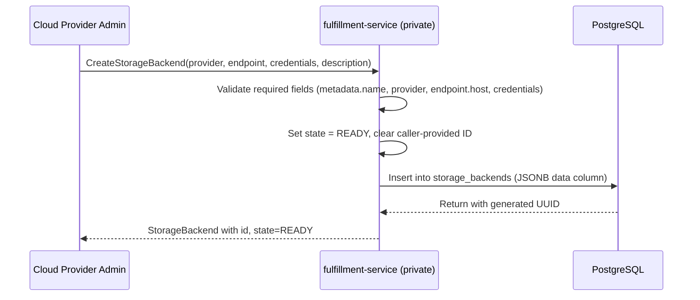

# StorageBackend API

## Summary

This enhancement adds a `StorageBackend` entity to the fulfillment-service, providing a private gRPC API (CRUD) and a public read-only API for managing storage array registrations. StorageBackend follows the NetworkClass pattern: DB-backed with no Kubernetes CRD and no reconciler. See [PRD](prd.md) for detailed requirements.

## Motivation

OSAC manages networking infrastructure through first-class API entities (NetworkClass, VirtualNetwork, Subnet) but has no equivalent for storage. Storage backend configuration is embedded in Ansible extra vars (`VAST_ENDPOINT`, `VAST_USERNAME`, `VAST_PASSWORD`), making backends invisible to the OSAC data model. Cloud Provider Admins cannot discover registered backends, rotate credentials, or inspect backend health through the API.

This gap blocks two capabilities: (1) composing tiered storage offerings where StorageTier entities (OSAC-1110) reference registered backends by ID, and (2) credential rotation without redeploying the fulfillment-service. Three prior enhancements addressed tenant-to-StorageClass resolution but left the infrastructure layer unmanaged.

StorageBackend introduces the infrastructure registration layer. It stores the provider type, management endpoint, and credentials. The entity is platform-scoped (not tenant-scoped), managed exclusively by Cloud Provider Admins through the private API. There is no public API — tenants do not need visibility into storage backends; they interact with storage through StorageTier (OSAC-1110).

### Goals

- Reuse the NetworkClass DB-backed server pattern (generic server, generic DAO, builder construction) with no reconciler or CRD. [Codebase: internal/servers/private_network_classes_server.go]
- Expose a private CRUD API only — no public API. Tenants interact with storage through StorageTier (OSAC-1110), not directly with backends.
- Store credentials inline in the JSONB `data` column, consistent with all existing OSAC entities (break_glass_credentials, identity_provider, user, cluster_template, hub).
- Keep the StorageBackend schema provider-agnostic so that non-VAST backends (Ceph, Pure) use the same entity without schema changes.
- Provide the foundation entity for StorageTier (OSAC-1110) composition without introducing StorageTier dependencies.

### Non-Goals

- Kubernetes CRD for StorageBackend — the entity is DB-backed only, like NetworkClass.
- Reconciler or controller registration — no backend provisioning occurs on create; the initial state is `READY`.
- Provider-specific credential validation — credential content is opaque per NFR-2.
- CSI driver installation or StorageClass creation on target clusters — these are part of the tenant onboarding reconciliation flow, which depends on both StorageBackend and StorageTier.
- StorageTier or StorageTierBackend entities — covered by OSAC-1110.

## Proposal

StorageBackend is a new entity in the fulfillment-service with two API surfaces:

**Private API** (`osac.private.v1.StorageBackends`): Full CRUD (Create, Get, List, Update, Delete). Used by Cloud Provider Admins and internal systems (e.g., future tenant onboarding controller that needs credentials to pass to AAP). No Signal RPC — StorageBackend has no reconciler or controller. No public API — tenants interact with storage through StorageTier, not directly with backends.

The database schema follows the standard JSONB `data` column pattern with `storage_backends` and `archived_storage_backends` tables. A unique partial index on `name` enforces FR-9 (name uniqueness among active records).

The generic server's `setPayload()` switch statement requires a new case for `StorageBackend`, and the Event proto requires a new `storage_backend` payload field.

### Workflow Description

**Actors:**
- Cloud Provider Admin — registers and manages storage backends via the private API
- Tenant — no direct access to StorageBackend; interacts with storage through StorageTier (OSAC-1110)

**Starting state:** The fulfillment-service is deployed with no StorageBackend records. Storage configuration exists only in Ansible extra vars.

**Registration flow:**



The diagram shows the registration path. The admin registers the backend via the private API with credentials provided inline. The fulfillment-service validates required fields (including `metadata.name`, which must be a valid DNS label per RFC 1035), sets the initial state to `READY`, generates a UUID, and persists the entity. Credentials are stored in the JSONB `data` column, consistent with how all other OSAC entities store credentials.

**Credential rotation:** The admin calls `UpdateStorageBackend` with new `credentials` fields. No redeployment is required.

**Decommission:** The admin calls `DeleteStorageBackend`. The backend is soft-deleted: excluded from List results but preserved in the `archived_storage_backends` table for audit. Name reuse is allowed after soft deletion.

**Error cases:**
- Duplicate name on active backend: Create returns `ALREADY_EXISTS` (enforced by the unique partial index).
- Missing required fields (metadata.name, provider, endpoint.host, credentials): Create returns `INVALID_ARGUMENT`.
- Name change on Update: returns `INVALID_ARGUMENT` (`metadata.name` is immutable after creation).
- Update with stale version and `lock=true`: returns `FAILED_PRECONDITION` (optimistic concurrency control).
- Delete of non-existent backend: returns `NOT_FOUND`.

### API Extensions

This enhancement adds the following API extensions:

- **Private gRPC service** `osac.private.v1.StorageBackends` — CRUD, registered in the gRPC server startup alongside `NetworkClasses`.
- **Event payload field** `storage_backend` added to `osac.private.v1.Event` — enables event-driven notifications for StorageBackend changes.

No public API is registered. Tenants do not need direct access to storage backends.

No CRDs, webhooks, or finalizers are introduced. No existing resources are modified. If the fulfillment-service is unavailable, StorageBackend operations fail but no other OSAC resources are affected — StorageBackend has no controller loop that could leave resources in an inconsistent state.

### Implementation Details/Notes/Constraints

#### Proto Schema — Private API

**`storage_backend_type.proto`** (`osac.private.v1`):

| Field | Type | Required | Description |
|-------|------|----------|-------------|
| `id` | `string` | Generated | UUID assigned by the DAO on create |
| `metadata` | `Metadata` | Yes | Standard OSAC metadata (name, labels, annotations, version) |
| `provider` | `string` | Yes | Storage provider identifier (e.g., `"vast"`, `"ceph"`, `"pure"`) |
| `description` | `string` | No | Human-readable description of the backend |
| `endpoint` | `StorageBackendEndpoint` | Yes | Management endpoint for the storage array |
| `credentials` | `StorageBackendCredentials` | Yes | Provider-specific credentials stored inline, consistent with existing OSAC credential patterns |
| `status` | `StorageBackendStatus` | System | Operational status, set on create |

**`StorageBackendEndpoint` message:**

| Field | Type | Required | Description |
|-------|------|----------|-------------|
| `host` | `string` | Yes | Hostname or IP of the storage management API |
| `port` | `int32` | No | Port number; provider-specific default if omitted |

**`StorageBackendCredentials` message:**

| Field | Type | Required | Description |
|-------|------|----------|-------------|
| `username` | `string` | Yes | Username for storage management API authentication |
| `password` | `string` | Yes | Password for storage management API authentication |

Credentials are stored inline in the JSONB `data` column, following the same pattern as `break_glass_credentials.password`, `identity_provider.client_secret`, `user.password`, `cluster_template.pull_secret`, and `hub.kubeconfig`. The credential content is opaque to the fulfillment-service — no provider-specific validation is performed (NFR-2).

**`StorageBackendStatus` message:**

| Field | Type | Required | Description |
|-------|------|----------|-------------|
| `state` | `StorageBackendState` | Yes | Current lifecycle state |
| `message` | `string` | No | Human-readable status detail |
| `model` | `string` | No | Storage array model (e.g., `"VAST C-100"`) |
| `firmware_version` | `string` | No | Reported firmware version |

**`StorageBackendState` enum:**

| Value | Number | Description |
|-------|--------|-------------|
| `STORAGE_BACKEND_STATE_UNSPECIFIED` | 0 | Default zero value |
| `STORAGE_BACKEND_STATE_READY` | 1 | Backend registered and available |

The enum starts with `READY` as the only operational state. Additional states (e.g., `PENDING`, `FAILED`, `DEGRADED`) are added when health probing or reconciliation capabilities are introduced. The `UNSPECIFIED` sentinel follows proto3 convention.

**`storage_backends_service.proto`** (`osac.private.v1`):

The service defines five RPCs following the NetworkClass service pattern (without Signal, since StorageBackend has no reconciler):

| RPC | HTTP Method | Path | Notes |
|-----|-------------|------|-------|
| `List` | `GET` | `/api/private/v1/storage_backends` | Pagination, CEL filter, ordering |
| `Get` | `GET` | `/api/private/v1/storage_backends/{id}` | `response_body: "object"` |
| `Create` | `POST` | `/api/private/v1/storage_backends` | `body: "object"`, `response_body: "object"` |
| `Update` | `PATCH` | `/api/private/v1/storage_backends/{object.id}` | `body: "object"`, `response_body: "object"` |
| `Delete` | `DELETE` | `/api/private/v1/storage_backends/{id}` | |

No Signal RPC is defined. Signal exists on other entities to wake up a reconciler when external state changes — StorageBackend has no reconciler, so Signal would have no consumer. Status fields (model, firmware_version) can be updated via the standard `Update` RPC if needed in the future.

#### Server Implementation

**`private_storage_backends_server.go`**: Follows the `PrivateNetworkClassesServer` pattern:

- Struct wraps `GenericServer[*privatev1.StorageBackend]`
- Builder pattern: `NewPrivateStorageBackendsServer()` returns a builder with `SetLogger`, `SetNotifier`, `SetAttributionLogic`, `SetTenancyLogic`, `SetMetricsRegisterer`, `Build()`
- `Create`: validates required fields (`metadata.name`, `provider`, `endpoint.host`, `credentials.username`, `credentials.password`), sets state to `STORAGE_BACKEND_STATE_READY`, clears caller-provided ID. The generic server's `validateName()` enforces RFC 1035 DNS label format (1–63 chars, lowercase alphanumeric + hyphens, no leading/trailing hyphens). Name uniqueness among active backends is enforced by the `storage_backends_unique_active_name` partial index.
- `Update`: fetches existing object, merges via `applyStorageBackendUpdate`, validates immutability of `provider` and `metadata.name` fields, delegates to generic server
- `Delete`: delegates directly to generic server (soft delete)

**Immutable fields on update:** `provider` and `metadata.name` are immutable after creation. Changing the storage provider would invalidate the endpoint, credentials, and any downstream StorageTier references. Name immutability ensures stable human-readable identifiers for operational use and prevents confusion when backends are referenced by name in logs and configurations.

#### Database Migration

Migration file: `54_create_storage_backends_tables.up.sql` (next available sequence number)

The migration creates two tables following the standard schema:

```sql
create table storage_backends (
  id text not null primary key,
  name text not null default '',
  creation_timestamp timestamp with time zone not null default now(),
  deletion_timestamp timestamp with time zone not null default 'epoch',
  finalizers text[] not null default '{}',
  creators text[] not null default '{}',
  tenants text[] not null default '{}',
  labels jsonb not null default '{}'::jsonb,
  annotations jsonb not null default '{}'::jsonb,
  data jsonb not null
);

create table archived_storage_backends (
  id text not null,
  name text not null default '',
  creation_timestamp timestamp with time zone not null,
  deletion_timestamp timestamp with time zone not null,
  archival_timestamp timestamp with time zone not null default now(),
  creators text[] not null default '{}',
  tenants text[] not null default '{}',
  labels jsonb not null default '{}'::jsonb,
  annotations jsonb not null default '{}'::jsonb,
  data jsonb not null
);
```

Indexes:

```sql
create index storage_backends_by_name on storage_backends (name);
create index storage_backends_by_owner on storage_backends using gin (creators);
create index storage_backends_by_tenant on storage_backends using gin (tenants);
create index storage_backends_by_label on storage_backends using gin (labels);
```

Name uniqueness among active backends (FR-9):

```sql
create unique index storage_backends_unique_active_name
  on storage_backends (name)
  where deletion_timestamp = 'epoch';
```

This partial index permits name reuse after soft deletion while preventing duplicate names among active records. The DAO's unique violation error maps to gRPC `ALREADY_EXISTS`.

#### Generic Server Changes

**`generic_server.go`** — `setPayload()` switch: Add a case for `*privatev1.StorageBackend` that calls `event.SetStorageBackend(object)`.

**`event_type.proto`** — Add a `StorageBackend storage_backend` field to the `Event` message's oneof payload (next available field number).

#### gRPC Server Registration

In `start_grpc_server_cmd.go`, add registration blocks for both servers following the NetworkClass pattern:

```go
// Private StorageBackends server
privateStorageBackendsServer, err := servers.NewPrivateStorageBackendsServer().
    SetLogger(logger).
    SetNotifier(notifier).
    SetAttributionLogic(attributionLogic).
    SetTenancyLogic(tenancyLogic).
    SetMetricsRegisterer(metricsRegisterer).
    Build()
privatev1.RegisterStorageBackendsServer(grpcServer, privateStorageBackendsServer)
```

### Security Considerations

StorageBackend inherits the existing fulfillment-service security model:

- **Authentication:** JWT validation via the gRPC interceptor chain. No changes to the authentication flow.
- **Authorization:** OPA policies control access to the private API endpoint. Only Cloud Provider Admins have access. There is no public API — tenants cannot access StorageBackend at all.
- **Credential storage:** Credentials are stored inline in the JSONB `data` column, consistent with all existing OSAC entities (`break_glass_credentials`, `identity_provider`, `user`, `cluster_template`, `hub`). Since there is no public API, credentials are never exposed to tenants.
- **Input validation:** The server validates required fields (`metadata.name`, `provider`, `endpoint.host`, `credentials.username`, `credentials.password`), DNS label format for `metadata.name` (RFC 1035, enforced by the generic server), and immutability of `provider` and `metadata.name` on update. The `endpoint.host` field is a string stored as-is; no DNS resolution or connection attempt is made during registration.

No new authentication, authorization, or encryption mechanisms are introduced.

### Failure Handling and Recovery

| Failure Mode | Behavior | User Observation | Recovery |
|---|---|---|---|
| Database unavailable during Create | gRPC interceptor rolls back the transaction | `UNAVAILABLE` error | Retry the request; the operation is idempotent (name uniqueness check prevents duplicates) |
| Duplicate active name on Create | Unique partial index violation | `ALREADY_EXISTS` with the conflicting name | Choose a different name or delete the existing backend first |
| Stale version on Update with `lock=true` | DAO rejects the write | `FAILED_PRECONDITION` | Re-fetch the current version and retry |
All operations are transactional (wrapped by the gRPC database transaction interceptor) and idempotent. There is no reconciliation loop that could leave resources in a partially updated state.

### RBAC / Tenancy

StorageBackend is platform-scoped, not tenant-scoped. It follows the same access model as NetworkClass:

- **Private API:** Accessible to Cloud Provider Admins and internal systems (osac-operator). OPA policies enforce role-based access. The `tenants` column in the database is empty (platform-scoped resources have no tenant owner).
- **No public API.** Tenants interact with storage through StorageTier (OSAC-1110), not directly with backends.

No `osac.openshift.io/tenant` or `osac.openshift.io/owner-reference` annotations are set on StorageBackend. This is consistent with NetworkClass, which is also platform-scoped. Tenant isolation applies at the StorageTier level (OSAC-1110), where tiers are assigned to tenants.

### Observability and Monitoring

No new observability changes. Existing monitoring mechanisms apply:

- The gRPC Prometheus interceptor records request counts, latencies, and error rates for all StorageBackend RPCs automatically (same as all other gRPC services).
- PostgreSQL NOTIFY events for StorageBackend CRUD operations are published through the existing event infrastructure.
- Structured logging via `slog` in the server implementation covers validation failures and DAO errors.

### Risks and Mitigations

**Soft-delete name reuse and StorageTier references:** When a backend is soft-deleted and its name is reused for a new backend, a StorageTier referencing the old backend by ID continues to resolve correctly (references use ID, not name). However, confusion may arise if operators expect name-based lookup to return the latest backend.

*Mitigation:* StorageTier references backends by ID. The API documentation explicitly states that List excludes soft-deleted backends and that name reuse is permitted after decommission.

### Drawbacks

**Platform-scoped entity with credentials in the database.** StorageBackend stores credentials inline in the JSONB `data` column, which means credential content (username/password) lives in PostgreSQL. This is consistent with all existing OSAC entities that store credentials (break_glass_credentials, identity_provider, user, cluster_template, hub), but worth noting as the attack surface grows with the number of backends. The private API exposes credentials to all Cloud Provider Admins regardless of which backend they manage.

## Alternatives (Not Implemented)

### Kubernetes CRD instead of DB-backed entity

StorageBackend could be a Kubernetes Custom Resource (like VirtualNetwork or Subnet) with a reconciler.

*Pros:* Native kubectl access, standard RBAC, built-in watch semantics, controller reconciliation loop for health checks.

*Cons:* Requires CRD definition in osac-operator, reconciler registration, cross-process coordination between the operator and fulfillment-service. NetworkClass established the DB-backed pattern for platform infrastructure entities, and deviating from it fragments the architecture without clear benefit — StorageBackend has no cluster-side state to reconcile.

*Rejection:* The DB-backed pattern is simpler, already proven for this use case, and aligns with the NetworkClass precedent. A CRD can be introduced later if reconciliation requirements emerge.

### Credentials as Kubernetes Secret reference

Instead of storing credentials inline, the fulfillment-service could store a `credentials_ref` string referencing a Kubernetes Secret.

*Pros:* Credential content never touches the database. Delegates security to the Kubernetes Secret infrastructure (encryption at rest, RBAC, integration with external secret managers like Vault via External Secrets Operator).

*Cons:* Introduces a new credential pattern that no existing OSAC entity uses — all current entities (break_glass_credentials, identity_provider, user, cluster_template, hub) store credentials inline. Adds operational complexity (Secret must exist, namespace resolution, lifecycle management). Creates an inconsistency in the codebase.

*Rejection:* Consistency with existing OSAC patterns outweighs the security benefit for phase 1. All other entities store credentials inline, and introducing a divergent pattern without an OSAC-core decision on unified credential management would create unnecessary complexity. This can be revisited when OSAC establishes a platform-wide credential storage strategy.

## Open Questions

None — all prior open questions have been resolved. Credentials are stored inline (matching existing OSAC patterns), and Signal RPC has been removed (no reconciler).

## Test Plan

Testing follows the fulfillment-service's established Ginkgo v2 test patterns:

**Unit/integration tests** (co-located in `internal/servers/`):

- `private_storage_backends_server_test.go`:
  - CRUD lifecycle: Create with all fields, Get by ID, List with pagination, Update with field mask, Delete (soft-delete)
  - Validation: missing `metadata.name`, missing `provider`, missing `endpoint.host`, missing `credentials` return `INVALID_ARGUMENT`; invalid DNS label name returns `INVALID_ARGUMENT`
  - Immutability: Update with changed `provider` returns `INVALID_ARGUMENT`; Update with changed `metadata.name` returns `INVALID_ARGUMENT`
  - Name uniqueness: Create with duplicate active name returns `ALREADY_EXISTS`; Create after soft-delete of same name succeeds
  - Optimistic locking: Update with stale version and `lock=true` returns `FAILED_PRECONDITION`
  - CEL filtering: List with `this.provider == "vast"` returns matching backends
  - Ordering: List with `metadata.name asc` returns sorted results
**Integration tests** (`it/`): StorageBackend CRUD via gRPC and REST endpoints against a kind cluster deployment, covering authentication and authorization.

**E2E tests** (deferred to StorageTier integration): End-to-end tests covering the StorageBackend -> StorageTier -> tenant onboarding flow are scoped to OSAC-1110.

## Graduation Criteria

Graduation criteria will be defined when targeting a release. Expected stages: Dev Preview -> Tech Preview -> GA based on production deployment feedback.

For initial merge:

- All integration tests pass
- `buf lint` passes with no warnings
- Private API endpoints are accessible via both gRPC and REST

## Upgrade / Downgrade Strategy

This is a new API with no upgrade impact. The database migration (`54_create_storage_backends_tables.up.sql`) is additive — it creates new tables and indexes without modifying existing schema.

**Downgrade:** Requires deleting all StorageBackend records and then reverting the database migration (dropping the `storage_backends` and `archived_storage_backends` tables). No other OSAC entities reference StorageBackend in this phase, so deletion has no cascading effects.

## Version Skew Strategy

StorageBackend exists entirely within the fulfillment-service. There is no CRD in osac-operator and no cross-component API dependency. Version skew between fulfillment-service and osac-operator does not affect StorageBackend.

When StorageTier (OSAC-1110) is implemented, it will reference StorageBackend by ID. At that point, the StorageTier implementation must handle the case where a referenced StorageBackend does not exist (fulfillment-service upgraded with StorageTier before StorageBackend records are created, or downgrade removes StorageBackend). This is scoped to OSAC-1110.

## Support Procedures

**Failure detection:**

- Missing or inaccessible backends: `grpc_server_handled_total{grpc_service="osac.private.v1.StorageBackends", grpc_code!="OK"}` metric shows elevated error rates.
- Database migration failure: `fulfillment-service` fails to start with migration error in logs.

**Disabling the feature:**

StorageBackend can be disabled by removing the server registration from `start_grpc_server_cmd.go` and reverting the database migration. Consequences:

- No impact on cluster health — StorageBackend has no reconciler or controller.
- No impact on existing workloads — no OSAC entity currently references StorageBackend.
- New StorageBackend API calls return `UNIMPLEMENTED`.

**Recovery:** Re-enable by restoring the server registration and re-running the migration. Data in the `storage_backends` table is preserved if only the server registration was removed. Consistency is maintained because all operations are transactional.

## Infrastructure Needed

None.
