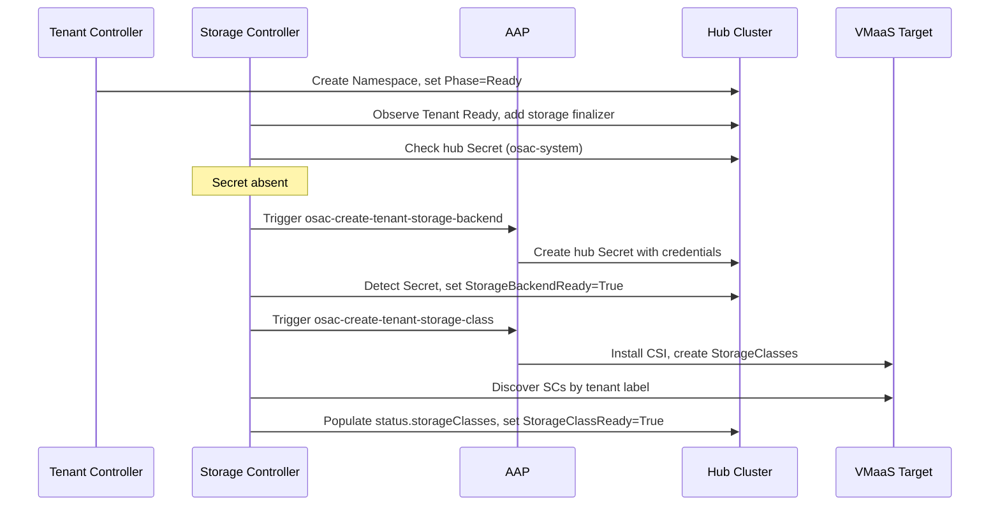

# Rework Tenant Storage Onboarding

## Summary

Extract all storage provisioning logic from the Tenant controller into a dedicated OSAC Storage Controller that owns storage-related conditions and status fields on the Tenant CR using the condition ownership pattern. The controller manages a two-stage storage lifecycle (backend setup, then cluster-side StorageClass installation) with four AAP playbooks. See [PRD](prd.md) for detailed requirements.

## Motivation

Storage provisioning logic is currently embedded in the Tenant controller (`internal/controller/tenant_controller.go`, ~350 of ~520 lines). The controller handles namespace creation, UserDefinedNetwork (UDN) reconciliation, StorageClass resolution, AAP job triggering, job polling, and storage deprovisioning — all in a single reconciliation loop. Storage readiness gates the Tenant phase: a Tenant cannot reach Ready until a StorageClass is resolved.

This coupling creates three problems. First, any change to storage onboarding risks regressions in namespace creation and UserDefinedNetwork (UDN) reconciliation. Second, supporting different storage workflows per delivery model (VMaaS requires immediate provisioning; CaaS requires waiting for ClusterOrder Ready) requires branching logic inside the Tenant controller. Third, the storage working group cannot iterate on storage onboarding without coordinating every change with the core tenant lifecycle.

The extraction moves the same provisioning logic into a new controller. The Tenant controller becomes namespace and UDN only. The OSAC Storage Controller owns all storage conditions and fields on the Tenant CR, following the Kubernetes condition ownership pattern where multiple controllers independently manage their own conditions on a shared resource — the same pattern used by kubelet, scheduler, and cloud-controller-manager on Node.

### Goals

- Reuse the existing `RunProvisioningLifecycle()` framework and `ProvisioningProvider` interface without modifying `pkg/provisioning/`. [Codebase: pkg/provisioning/provision_lifecycle.go]
- Follow the established controller reconciliation pattern (Reconcile → handleUpdate/handleDelete, oldStatus comparison, finalizer management). [Codebase: internal/controller/tenant_controller.go]
- Implement Stage 1 (backend) and Stage 2 (class) as separate operations with independent job tracking to avoid coupling that would need to be untangled when CaaS support is added.
- Name the controller broadly ("OSAC Storage Controller") to serve as the single entry point for all future storage reconciliation.

### Non-Goals

- Modifying the shared provisioning framework (`pkg/provisioning/`).
- Adding a new CRD — storage state lives on the Tenant CR via condition ownership.
- Changing the ComputeInstance controller — it continues to read `status.storageClasses` from the Tenant CR.
- StorageClass creation in the controller — the OSAC Storage Controller discovers existing SCs via label but does not create them directly. StorageClass creation is handled by the `osac-create-tenant-storage-class` AAP playbook, which is in scope (FR-8).
- CaaS Stage 2 trigger logic (OSAC-1123) — the controller establishes the ClusterOrder watch to prepare for CaaS support, but the trigger logic for cluster-side storage setup on CaaS clusters is a separate PRD and delivery.
- VAST-specific logic in the operator — the controller is provider-agnostic; VAST specifics live in AAP playbooks.

## Proposal

Introduce an OSAC Storage Controller that watches Tenant CRs as its primary resource. The controller owns `StorageBackendReady` and `StorageClassReady` conditions, `status.storageClasses`, and `status.jobs` on the Tenant CR. It places its own finalizer (`osac.openshift.io/storage`) for teardown. The Tenant controller is stripped of all storage logic — it manages namespace creation and UserDefinedNetwork (UDN) reconciliation only.

The AAP playbooks are split from two templates (create/delete) into four lifecycle actions matching the two-stage model: `osac-create-tenant-storage-backend`, `osac-create-tenant-storage-class`, `osac-delete-tenant-storage-class`, `osac-delete-tenant-storage-backend`.

### Workflow Description

**Actor: Cloud Provider Admin (creates Tenant CR)**

Starting state: A Tenant CR exists in the tenant namespace. The Tenant controller has set `NamespaceReady=True` and `Phase=Ready`.

#### Stage 1 — Backend Setup

1. OSAC Storage Controller observes Tenant reaching `Phase=Ready` via Tenant watch.
2. Controller adds its finalizer (`osac.openshift.io/storage`) to the Tenant CR.
3. Controller checks for a hub Secret in `osac-system` namespace with label `osac.openshift.io/tenant=<tenantName>`.
4. Hub Secret absent → controller triggers `osac-create-tenant-storage-backend` AAP job. Records job in `status.jobs`.
5. Controller polls AAP job status at `StatusPollInterval` (default 30s).
6. AAP job completes successfully → hub Secret now exists with per-tenant storage credentials.
7. Controller detects hub Secret → sets `StorageBackendReady=True` on the Tenant.

#### Stage 2 — Cluster-Side Setup (VMaaS)

8. After `StorageBackendReady=True`, controller triggers `osac-create-tenant-storage-class` AAP job to install CSI operator and create per-tenant StorageClasses on the VMaaS target cluster.
9. Controller polls until the job completes, then discovers StorageClasses on the target cluster using `osac.openshift.io/tenant=<tenantName>` label.
10. Controller populates `status.storageClasses` with resolved entries and sets `StorageClassReady=True`.



The diagram shows the two-stage flow from Tenant creation to storage readiness. The Tenant controller and Storage Controller operate independently — the Tenant controller sets `Phase=Ready` based on namespace existence; the Storage Controller observes this and begins its own lifecycle. The two controllers never call each other directly.

#### Error Handling

- **AAP job fails (Stage 1 or 2):** The relevant condition is set to `False` with a reason reflecting the failure. The controller does not retry automatically after failure — it waits for an external trigger (Tenant CR update, Secret watch event) to avoid infinite retry loops. This follows the same pattern used by other OSAC controllers.
- **Hub Secret deleted after Ready:** Secret watch triggers re-reconciliation. `StorageBackendReady` set to `False`, re-triggers Stage 1.
- **StorageClasses deleted after Ready:** StorageClass watch triggers re-reconciliation. `StorageClassReady` set to `False`, `status.storageClasses` cleared, re-triggers Stage 2.

#### Tenant Deletion Flow

1. OSAC Storage Controller observes Tenant deletion via `DeletionTimestamp`.
2. Controller triggers `osac-delete-tenant-storage-class` AAP job (cluster-side cleanup: remove StorageClasses, CSI Secrets, VolumeSnapshotClasses from the target cluster).
3. On class cleanup success, triggers `osac-delete-tenant-storage-backend` AAP job (backend teardown: remove VAST tenant, views, quotas, and hub Secret).
4. On backend teardown success, removes the `osac.openshift.io/storage` finalizer.
5. If either teardown job fails with `BlockDeletionOnFailure=true`, the finalizer remains and the Tenant stays in `Terminating` until resolved.

### API Extensions

**No new CRD is introduced.** The Tenant CR is extended with a new condition type and additional print columns. Existing fields (`status.storageClasses`, `status.jobs`) are retained — only their ownership changes from the Tenant controller to the Storage Controller.

**New condition type on Tenant CR:**

```go
const (
    TenantConditionStorageBackendReady TenantConditionType = "StorageBackendReady"
)
```

`StorageClassReady` already exists on the Tenant CR.

**New finalizer on Tenant CR:**

The Storage Controller adds `osac.openshift.io/storage` alongside the Tenant controller's existing `osac.openshift.io/tenant`. Both controllers manage their own finalizers independently.

**Print column additions:**

```go
// +kubebuilder:printcolumn:name="StorageBackendReady",type=string,JSONPath=`.status.conditions[?(@.type=="StorageBackendReady")].status`,priority=1
// +kubebuilder:printcolumn:name="StorageClassReady",type=string,JSONPath=`.status.conditions[?(@.type=="StorageClassReady")].status`,priority=1
```

**SetStatusCondition / GetStatusCondition helpers:**

Add condition helper methods to the Tenant type. These allow the Storage Controller to set conditions without importing condition manipulation logic:

```go
func (t *Tenant) SetStatusCondition(condType TenantConditionType, status metav1.ConditionStatus, reason, message string)
func (t *Tenant) GetStatusCondition(condType TenantConditionType) *metav1.Condition
```

**Operational impact if Storage Controller is down:** Tenant creation and deletion proceed normally (Tenant controller handles namespace/UDN). Storage conditions remain in their last-known state. New Tenants will not get storage provisioned until the Storage Controller recovers. Existing Tenants with `StorageClassReady=True` are unaffected — ComputeInstance reads from Tenant status, not from the controller.

### Implementation Details/Notes/Constraints

**Controller watches:**

| Watch | Resource | Namespace | Purpose |
|-------|----------|-----------|---------|
| Primary | Tenant | OSAC_TENANT_NAMESPACE | Main reconciliation target |
| Secondary | Secret | osac-system | Re-reconcile when hub Secret appears/disappears |
| Secondary | StorageClass | (cluster-scoped) | Re-reconcile when SCs with tenant label change |
| Secondary | ClusterOrder | (all namespaces) | CaaS Stage 2 preparation (no action in v0.1) |

**Reconcile flow:**

```
1. Fetch Tenant CR
2. Check management-state annotation → skip if Unmanaged
3. Save oldStatus
4. If DeletionTimestamp is zero → handleUpdate()
   a. Add storage finalizer if absent
   b. Stage 1: check hub Secret → trigger osac-create-tenant-storage-backend if absent
   c. Stage 2: after StorageBackendReady=True → trigger osac-create-tenant-storage-class
   d. Discover SCs on target cluster → populate status.storageClasses
   e. Set StorageClassReady=True when all expected SCs are present
5. If DeletionTimestamp is set → handleDelete()
   a. Trigger osac-delete-tenant-storage-class → poll until complete
   b. Trigger osac-delete-tenant-storage-backend → poll until complete
   c. Remove storage finalizer
6. Compare oldStatus vs current → Status().Update() if changed
```

**Two-provider approach for 4 AAP templates:**

The `ProvisioningProvider` interface supports one provision/deprovision template pair per instance. The Storage Controller uses two provider instances:

| Provider | Provision Template | Deprovision Template | Stage |
|----------|-------------------|---------------------|-------|
| Backend provider | `osac-create-tenant-storage-backend` | `osac-delete-tenant-storage-backend` | Stage 1 |
| Class provider | `osac-create-tenant-storage-class` | `osac-delete-tenant-storage-class` | Stage 2 |

The controller manages two separate job lifecycles. `status.jobs` on the Tenant CR tracks both — differentiated by extending `JobType` with four new values:

```go
const (
    JobTypeStorageBackendProvision   JobType = "storage-backend-provision"
    JobTypeStorageBackendDeprovision JobType = "storage-backend-deprovision"
    JobTypeStorageClassProvision     JobType = "storage-class-provision"
    JobTypeStorageClassDeprovision   JobType = "storage-class-deprovision"
)
```

This enables type-safe filtering via `FindLatestJobByType()`. `JobType` was designed to differentiate specific job types — the existing `provision`/`deprovision` values are the generic ones used by most controllers; adding controller-specific types is the natural extension as the operator grows.

**Tier resolution algorithm:**

Moved from `tenant_controller.go` to the Storage Controller without modification. The algorithm:
1. List StorageClasses on the target cluster with `osac.openshift.io/tenant=<tenantName>` label.
2. List StorageClasses with `osac.openshift.io/tenant=Default` label (shared fallback).
3. Group by `osac.openshift.io/storage-tier` label value.
4. For each tier: use tenant-specific SC if exactly one exists; fall back to shared Default if exactly one exists; emit warning event if multiple found for the same tier.
5. Return `[]ResolvedStorageClass` with one entry per resolved tier.

[Codebase: internal/controller/tenant_controller.go, `getTenantStorageClasses()` function]

**Hub Secret check (new in this design):**

The current Tenant controller does not check for a hub Secret — it only checks for StorageClasses. This design adds a hub Secret check as the Stage 1 gate. The check queries Secrets in `osac-system` namespace with label `osac.openshift.io/tenant=<tenantName>`.

**VMaaS target cluster:**

Determined by `OSAC_REMOTE_CLUSTER_KUBECONFIG` env var. If not set, the hub cluster is the VMaaS target. The Storage Controller obtains a client for the target cluster via `getTargetClient()` (shared helper, same as Tenant controller). [Codebase: cmd/main.go, `envRemoteClusterKubeconfig`]

**Tenant controller simplification:**

Remove from `TenantReconciler`:
- `ProvisioningProvider`, `StatusPollInterval`, `MaxJobHistory` struct fields
- `handleStorageProvisioning()`, `handleStorageDeprovisioning()`, `pollProvisionJob()`, `needsProvisionJob()`
- `getTenantStorageClasses()`, `tenantStorageClassExists()`, tier resolution helpers (`tierResolutionResult`, `groupByTier`, `joinStorageClassNames`, `tierLabelPattern`)
- `mapStorageClassToTenant()`, `allTenantReconcileRequests()`, `storageClassTenantPredicate()`
- StorageClass watch from `SetupWithManager()`
- StorageClass RBAC marker
- Storage field reset in `handleUpdate()` (`instance.Status.StorageClasses = nil`)
- SC resolution and provisioning logic from `handleUpdate()`
- Deprovisioning from `handleDelete()`

After extraction, the Tenant controller manages: finalizer, namespace check, `NamespaceReady` condition, UserDefinedNetwork (UDN) reconciliation, Phase transitions. Approximately 170 lines.

**Tenant Phase semantics change:** Today, a Tenant cannot reach `Phase=Ready` until StorageClasses are resolved — storage gates the phase. After extraction, `Phase=Ready` means the tenant namespace exists and UDN is configured. Storage readiness is reported separately via `StorageBackendReady` and `StorageClassReady` conditions. This decoupling is intentional — it allows the Tenant to be "ready" for non-storage operations (namespace, networking) while storage provisioning proceeds asynchronously. The ComputeInstance controller already checks `StorageClassReady` independently before provisioning VMs.

**Controller registration (`cmd/main.go`):**

```go
func setupStorageController(mgr mcmanager.Manager, maxJobHistory int) error {
    // Create two AAP provider instances: backend and class
    backendProvider := createAAPProvider(backendProvisionTemplate, backendDeprovisionTemplate, ...)
    classProvider := createAAPProvider(classProvisionTemplate, classDeprovisionTemplate, ...)

    return NewStorageReconciler(mgr, tenantNamespace, targetCluster,
        backendProvider, classProvider, pollInterval, maxJobHistory,
    ).SetupWithManager(mgr)
}
```

New env vars:
- `OSAC_STORAGE_AAP_BACKEND_PROVISION_TEMPLATE` (default: `osac-create-tenant-storage-backend`)
- `OSAC_STORAGE_AAP_BACKEND_DEPROVISION_TEMPLATE` (default: `osac-delete-tenant-storage-backend`)
- `OSAC_STORAGE_AAP_CLASS_PROVISION_TEMPLATE` (default: `osac-create-tenant-storage-class`)
- `OSAC_STORAGE_AAP_CLASS_DEPROVISION_TEMPLATE` (default: `osac-delete-tenant-storage-class`)

### Security Considerations

The feature inherits the existing security model without changes. Admin credentials (VAST endpoint, username, password) remain ephemeral — mounted as environment variables in the AAP automation pod, cleared after use, never persisted to Kubernetes. [PRD: NFR-1]

Per-tenant credentials are stored in Secrets in the `osac-system` namespace with RBAC restricted to the operator service account. The Storage Controller requires `get;list;watch` on Secrets in `osac-system`. [PRD: NFR-2]

Controller logs and Kubernetes events must not expose Secret contents, credentials, or sensitive AAP parameters. AAP job messages are sanitized by the provider before recording in `status.jobs`. [PRD: NFR-4]

No tenant isolation changes. The Storage Controller operates on Tenant CRs in the `OSAC_TENANT_NAMESPACE`, using the same namespace-scoped predicate as the Tenant controller. StorageClass discovery uses the `osac.openshift.io/tenant` label for tenant scoping.

### Failure Handling and Recovery

| Failure | Behavior | Recovery |
|---------|----------|----------|
| Hub Secret absent, no AAP configured | `StorageBackendReady=False`, reason `NoProvider` | Configure AAP provider and restart controller |
| Stage 1 AAP job fails | `StorageBackendReady=False`, reason from job message. Phase unchanged (stays Progressing). | Wait for external trigger (Tenant update, Secret event). No automatic retry after failure. |
| Stage 2 AAP job fails | `StorageClassReady=False`, reason from job message. | Same as Stage 1. |
| Hub Secret deleted after `StorageBackendReady=True` | Secret watch triggers re-reconcile. `StorageBackendReady` set to `False`. | Next reconcile re-triggers Stage 1. |
| StorageClasses deleted after `StorageClassReady=True` | SC watch triggers re-reconcile. `StorageClassReady` set to `False`, `status.storageClasses` cleared. | Next reconcile re-triggers Stage 2. |
| Teardown job fails with `BlockDeletionOnFailure` | Finalizer not removed. Tenant stays `Terminating`. | Admin investigates, fixes backend issue, then controller retries on next reconcile. |
| Controller restart mid-reconciliation | Job state is persisted in `status.jobs` on the Tenant CR. | Controller resumes polling from last known job state. |
| Status update conflict (Tenant controller writes simultaneously) | Kubernetes returns `409 Conflict` on `Status().Update()`. | controller-runtime retries the reconciliation automatically. Standard optimistic concurrency. |

Idempotency: Stage 1 checks hub Secret existence before triggering — if the Secret already exists (from a prior successful job), no new job is triggered. Stage 2 checks existing StorageClasses before triggering — same logic. The `needsProvisionJob()` helper prevents duplicate triggers when a job has already succeeded.

### RBAC / Tenancy

No RBAC or tenancy model changes. The Storage Controller requires:

```go
// +kubebuilder:rbac:groups=osac.openshift.io,resources=tenants,verbs=get;list;watch;update;patch
// +kubebuilder:rbac:groups=osac.openshift.io,resources=tenants/status,verbs=get;update;patch
// +kubebuilder:rbac:groups=osac.openshift.io,resources=tenants/finalizers,verbs=update
// +kubebuilder:rbac:groups=osac.openshift.io,resources=clusterorders,verbs=get;list;watch
// +kubebuilder:rbac:groups="",resources=secrets,verbs=get;list;watch
// +kubebuilder:rbac:groups=storage.k8s.io,resources=storageclasses,verbs=get;list;watch
// +kubebuilder:rbac:groups=events.k8s.io,resources=events,verbs=create;patch
```

The Tenant controller's StorageClass RBAC (`storage.k8s.io/storageclasses: get;list;watch`) is removed — only the Storage Controller needs it.

### Observability and Monitoring

No new Prometheus metrics or alerts. Storage readiness is observable via:

- `kubectl get tenant` — print columns show `StorageBackendReady` and `StorageClassReady` status (priority=1, visible with `-o wide`).
- `kubectl describe tenant <name>` — conditions section shows both storage conditions with reasons and messages.
- Controller logs emit structured messages at each stage transition (job triggered, job polling, job succeeded/failed, Secret detected, SC discovered).
- Kubernetes events: `DuplicateStorageClass` warning event when multiple SCs found for the same tier (existing behavior, moved to Storage Controller).

### Risks and Mitigations

**Breaking change in AAP playbook interface:** The current combined playbook (`osac-create-tenant-storage`) is replaced by four separate playbooks. Deploying AAP changes without operator changes causes the Tenant controller to call a template name that no longer exists — provisioning fails. Mitigation: coordinated PR merge across osac-operator and osac-aap. PRs are linked in descriptions. Deployment documentation specifies both components must be updated together. [PRD: NFR-3]

**Status update conflicts between controllers:** Both the Tenant controller and the Storage Controller call `r.Status().Update()` on the same Tenant CR. If both controllers reconcile simultaneously, one will receive a `409 Conflict` from the API server. Mitigation: controller-runtime automatically retries the reconciliation on conflict. The `oldStatus` comparison in each controller's Reconcile function prevents unnecessary writes. This is the standard multi-controller pattern used in Kubernetes (kubelet, scheduler, and cloud-controller-manager all update Node status independently).

### Drawbacks

The OSAC Storage Controller adds a new controller to the operator, increasing operational complexity. Each storage-related reconciliation now involves two controllers (Tenant for namespace, Storage for storage) instead of one.

These trade-offs are justified by the decoupling benefit: the storage WG can iterate independently, and the two-stage model required for CaaS support cannot be cleanly embedded in the Tenant controller without branching logic that couples delivery model decisions to the tenant lifecycle.

## Alternatives (Not Implemented)

### TenantStorage CRD

Introduce a separate TenantStorage CRD to capture per-tenant storage state. The Storage Controller would create TenantStorage when a Tenant reaches Ready, and the ComputeInstance controller would read StorageClasses from TenantStorage status instead of Tenant status.

**Pros:** Clean separation of storage state from tenant state. Dedicated `kubectl get tenantstorage` for observability.

**Cons:** Cross-resource consistency risk — Tenant and TenantStorage must stay in sync. Deletion ordering problems — TenantStorage must be torn down before Tenant is deleted, requiring controller-driven deletion (no owner reference) to ensure AAP cleanup runs before resource removal. ComputeInstance controller changes needed to read from TenantStorage. Feedback controller changes needed for fulfillment-service integration.

**Rejection reason:** Condition ownership on the Tenant CR achieves the same decoupling without the consistency and deletion ordering complexity. The Kubernetes condition ownership pattern is well-established (kubelet/scheduler/cloud-controller on Node).

### Keep storage logic in Tenant controller

Retain all storage provisioning in the Tenant controller and add feature flags for CaaS vs VMaaS branching.

**Pros:** No new controller. Simpler deployment.

**Cons:** CaaS Stage 2 triggering requires the ClusterOrder controller to notify the Tenant controller, coupling cluster provisioning to tenant lifecycle. Feature flags in a controller create long-lived branches that are hard to test independently.

**Rejection reason:** The storage WG needs to iterate independently, and the two-stage model for CaaS cannot be cleanly embedded in the Tenant controller.

### ConfigMap per tenant for storage state

Use a ConfigMap instead of CRD conditions to track storage state.

**Pros:** No CRD changes needed.

**Cons:** Loses structured status, conditions, phase tracking, print columns, and `kubectl` integration. No validation. No watch-based reconciliation.

**Rejection reason:** Kubernetes conditions provide structured, observable, and watchable state tracking with no additional infrastructure.

## Open Questions

### 1. Should the Storage Controller default to enabled or disabled?

The operator uses per-controller enable flags (e.g., `OSAC_ENABLE_CLUSTER_CONTROLLER`). If no flags are set, all controllers run. The Storage Controller needs its own flag.

**Proposed approach:** Default to enabled, following the existing convention. Deployments that don't need storage provisioning can set `OSAC_ENABLE_STORAGE_CONTROLLER=false`.

- **Owner:** Storage WG
- **Impact:** `cmd/main.go` controller registration

## Test Plan

**Unit tests** (Ginkgo/Gomega, `internal/controller/storage_controller_test.go`):
- Stage 1: Tenant Ready → hub Secret absent → AAP job triggered → Secret created → `StorageBackendReady=True`
- Stage 2: `StorageBackendReady=True` → AAP job triggered → SCs discovered → `StorageClassReady=True`
- Deletion: teardown sequence (class then backend), finalizer removal on success, finalizer retained on failure
- Management-state: `Unmanaged` annotation skips reconciliation
- Edge cases: hub Secret deleted after Ready, SCs deleted after Ready, controller restart mid-job

**Tenant controller tests** (updated `internal/controller/tenant_controller_test.go`):
- Verify no storage logic: Tenant reaches Ready based on namespace only, no SC resolution or AAP interaction
- Verify storage fields (`status.storageClasses`, `status.jobs`) are not modified by the Tenant controller

**Integration tests** (envtest):
- Two controllers running simultaneously on the same Tenant CR
- Status update conflict handling (verify both controllers converge)

**E2E tests** (OSAC deployment connected to a VAST appliance):
- Full lifecycle: Tenant creation → Stage 1 → Stage 2 → StorageClasses visible → Tenant deletion → teardown complete

## Graduation Criteria

Graduation criteria will be defined when targeting a release. Expected stages: Dev Preview -> Tech Preview -> GA based on production deployment feedback.

## Upgrade / Downgrade Strategy

This is a refactoring of existing behavior, not a new API. On upgrade:

- The Tenant CRD gains a `StorageBackendReady` condition type and updated print columns. CRD update via `make manifests`.
- The Storage Controller takes ownership of `StorageClassReady`, `status.storageClasses`, and `status.jobs`. The Tenant controller stops writing to these fields.
- Existing Tenants with `StorageClassReady=True` continue to function — the Storage Controller detects the existing hub Secret and StorageClasses and sets conditions to `True` without re-triggering AAP.

On downgrade:

- Revert the operator binary to the previous version. The Tenant controller resumes writing to `StorageClassReady`, `status.storageClasses`, and `status.jobs`.
- Remove the `StorageBackendReady` condition from existing Tenants manually (or let it remain as a no-op).
- The `osac.openshift.io/storage` finalizer must be removed from all Tenants before downgrading, or the Tenant controller must be updated to handle it.

AAP playbook changes and operator changes must be deployed together (NFR-3).

## Version Skew Strategy

The osac-operator and osac-aap must be updated together. Version skew scenarios:

- **Operator updated, AAP not updated:** The Storage Controller calls `osac-create-tenant-storage-backend` but the AAP job template doesn't exist yet. The AAP provider returns an error, job is recorded as Failed. The controller retries on next reconcile after AAP is updated.
- **AAP updated, operator not updated:** The old Tenant controller calls `osac-create-tenant-storage` which no longer exists (renamed to `osac-create-tenant-storage-backend`). Storage provisioning fails until the operator is updated.

Both scenarios are recoverable — no data loss. The recommended deployment order is operator first, then AAP, because the operator handles missing templates gracefully (retry with backoff).

## Support Procedures

**Failure detection:**

- `kubectl get tenant -o wide` — check `StorageBackendReady` and `StorageClassReady` columns. `False` indicates a storage provisioning issue.
- `kubectl describe tenant <name>` — conditions section shows detailed reasons and messages for each storage condition.
- `kubectl get tenant <name> -o jsonpath='{.status.jobs}'` — inspect job history for failed jobs with error messages.
- Controller logs (search for `storage-controller`) — structured messages for each stage transition.

**Disabling the Storage Controller:**

Set `OSAC_ENABLE_STORAGE_CONTROLLER=false` in the operator deployment. Consequences:
- Storage conditions remain in their last-known state on existing Tenants.
- New Tenants get namespace and UDN but no storage provisioning.
- Existing Tenants with `StorageClassReady=True` are unaffected — ComputeInstance reads from Tenant status.

Alternatively, set `osac.openshift.io/management-state: Unmanaged` annotation on individual Tenants to skip storage reconciliation per-tenant.

**Recovery:**

Re-enable the controller or remove the annotation. The controller re-evaluates state from scratch on next reconcile — checks hub Secret, discovers StorageClasses, sets conditions accordingly. No data loss.

## Infrastructure Needed

None.
