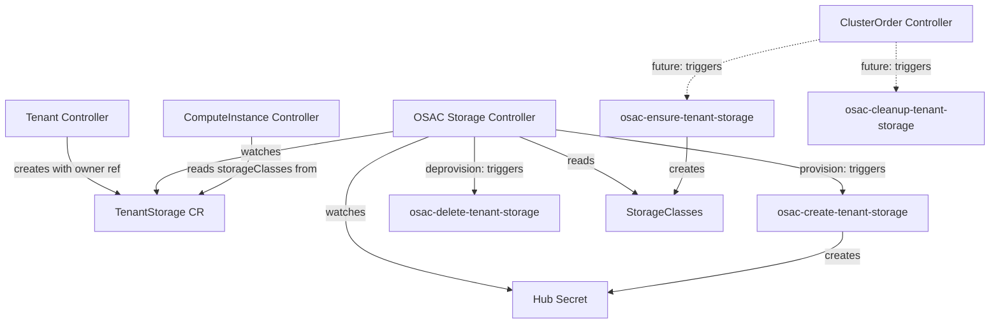

# Rework Tenant Storage Onboarding — Design

| Field       | Value                                                      |
|-------------|------------------------------------------------------------|
| Author(s)   | Zoltan Szabo, Akshay Nadkarni                              |
| Jira        | [OSAC-23](https://redhat.atlassian.net/browse/OSAC-23)     |
| PRD         | [prd.md](prd.md)                                           |
| Date        | 2026-06-05                                                 |

# 1. Overview

This design extracts storage provisioning logic from the Tenant controller into a dedicated OSAC Storage Controller with a new TenantStorage CRD. The Tenant controller creates a TenantStorage CR during onboarding; the OSAC Storage Controller handles Phase 1 backend setup, StorageClass resolution, and teardown independently. The AAP playbooks are split into four lifecycle actions to match. See the [PRD](prd.md) for requirements and motivation.

# 2. Goals and Non-Goals

## 2.1 Goals

- Reuse the existing `provisioning.RunProvisioningLifecycle()` framework and `ProvisioningProvider` interface — no changes to the shared provisioning package. [Codebase: pkg/provisioning/provision_lifecycle.go]
- Follow the established controller pattern (Reconcile → handleUpdate/handleDelete, oldStatus compare, finalizer management). [Codebase: internal/controller/tenant_controller.go]
- Keep the TenantStorage CRD spec minimal (`tenantRef` only) to avoid coupling to tier schema that is still evolving. [Locked: D1]
- Name the controller broadly ("OSAC Storage Controller") so it can absorb future storage responsibilities (backend registration, resource creation storage) without renaming. [Locked: D2]

## 2.2 Non-Goals

- Modifying the shared provisioning framework (`pkg/provisioning/`)
- Adding a feedback controller for TenantStorage (no fulfillment-service integration needed for this CRD)
- Changes to the storage provider role logic (`setup`, `ensure_storage_class`, `teardown` tasks) — the same tasks run, only the playbook entry points, dispatcher, and job template names change

# 3. Motivation / Background

Storage provisioning currently runs inside the Tenant controller: it checks for hub Secrets, triggers AAP jobs, polls for completion, resolves StorageClasses by label, and tracks storage jobs — all interleaved with namespace creation, UDN reconciliation, and tenant status management. This coupling makes it difficult for the storage working group to iterate on storage onboarding without risking regressions in tenant lifecycle. It also blocks CaaS storage (OSAC-1123), which needs a two-phase model where Phase 1 runs at tenant onboarding and Phase 2 runs after the HyperShift cluster is ready — logic that doesn't belong in the Tenant controller.

The extraction is mechanical: the same provisioning logic moves from one controller to another, the same AAP provider interface is used, and the same status patterns apply. The primary design decisions are about where to draw the boundary and how the two controllers communicate.

# 4. Design

## 4.1 Architecture

The diagram below shows the component relationships after the extraction. Arrows indicate the direction of control flow or data dependency.



The Tenant controller creates a TenantStorage CR with an owner reference during `handleUpdate`, immediately after ensuring the tenant namespace exists. The OSAC Storage Controller watches TenantStorage CRs and drives the provisioning lifecycle — triggering `osac-create-tenant-storage` (Phase 1) on provision and `osac-delete-tenant-storage` on deletion. The ComputeInstance controller looks up the TenantStorage CR by tenant name to get the resolved StorageClasses for AAP context injection. The owner reference ensures TenantStorage is garbage-collected when the Tenant is deleted. Dashed lines show future CaaS integration (OSAC-1123) where the ClusterOrder controller triggers Phase 2 (`osac-ensure-tenant-storage`) and cleanup.

### Controller responsibilities after extraction

| Controller | Responsibilities |
|-----------|-----------------|
| Tenant | Namespace creation, UDN reconciliation, TenantStorage CR creation |
| OSAC Storage | Hub Secret check, Phase 1 AAP provisioning, StorageClass resolution, phase/condition management, teardown |
| ComputeInstance | Read StorageClasses from TenantStorage status (instead of Tenant status) |

### Reconciliation flow — OSAC Storage Controller

`handleUpdate`:
1. Add finalizer (`osac.openshift.io/tenantstorage-finalizer`)
2. Look up hub Secret for tenant in `osac-system` namespace
3. If absent → call `provisioning.RunProvisioningLifecycle()` with `osac-create-tenant-storage` template
4. If present → resolve StorageClasses via `getTenantStorageClasses()`, set phase to Ready, set `StorageBackendReady` condition to True

`handleDelete`:
1. Trigger `osac-delete-tenant-storage` AAP job via `TriggerDeprovisionJob()`
2. Poll until terminal
3. Remove finalizer

This follows the same structure as the existing Tenant controller's storage handling — the logic moves, the pattern stays identical. [Codebase: internal/controller/tenant_controller.go]

### Watches

| Watch | Purpose |
|-------|---------|
| TenantStorage CRs (primary) | Standard controller watch |
| Secrets in tenant namespace | Re-reconcile when hub Secret appears/disappears (filtered by `secretTenantPredicate`) |
| StorageClasses | Re-reconcile when SCs with tenant label are created/deleted (filtered by `storageClassTenantPredicate`) |

## 4.2 AAP Playbook Split

The previous single playbook (`playbook_osac_configure_tenant_storage.yml`) executed both Phase 1 (backend setup) and Phase 2 (cluster-side CSI + StorageClasses) in a single run. This design splits it into four playbooks aligned with the storage lifecycle actions. [Locked: D4]

### Playbook mapping

| Before | After | Lifecycle Action |
|--------|-------|-----------------|
| `playbook_osac_configure_tenant_storage.yml` (Phase 1 + 2) | `playbook_osac_create_tenant_storage.yml` (Phase 1 only) | Provision backend: create VAST org, VIP pool, credentials, hub Secret |
| (embedded in configure) | `playbook_osac_ensure_tenant_storage.yml` (Phase 2 only) | Cluster-side setup: install CSI driver, create StorageClasses with retry |
| (none) | `playbook_osac_cleanup_tenant_storage.yml` | Cluster-side teardown: remove StorageClasses, VolumeSnapshotClasses, CSI Secret (handles unreachable clusters) |
| `playbook_osac_delete_tenant_storage.yml` | `playbook_osac_delete_tenant_storage.yml` | Backend teardown: delete VAST org, views, quotas, remove hub Secret |

### Role changes

The `storage_provider` role dispatcher (`storage_provider/tasks/main.yaml`) gains a `cleanup` action alongside the existing `setup`, `ensure_storage_class`, and `teardown` actions. The `vast_storage` role implements `cleanup.yaml` which removes Kubernetes resources by label (`osac.openshift.io/tenant`), handling unreachable target clusters gracefully (logs warning, continues).

No changes to the core role logic for `setup`, `ensure_storage_class`, or `teardown` — the same tasks run, just triggered from separate playbook entry points.

### AAP config-as-code

Four job templates replace the previous two in `config_as_code/roles/aap/vars/controller.yml`:

| Job Template | Playbook | Triggered By |
|-------------|----------|-------------|
| `osac-create-tenant-storage` | `playbook_osac_create_tenant_storage.yml` | OSAC Storage Controller (provision) |
| `osac-ensure-tenant-storage` | `playbook_osac_ensure_tenant_storage.yml` | ClusterOrder controller (future, OSAC-1123) |
| `osac-cleanup-tenant-storage` | `playbook_osac_cleanup_tenant_storage.yml` | OSAC Storage Controller (cluster cleanup before teardown) |
| `osac-delete-tenant-storage` | `playbook_osac_delete_tenant_storage.yml` | OSAC Storage Controller (deprovision) |

The operator references these template names via environment variables: `OSAC_TENANT_STORAGE_AAP_PROVISION_TEMPLATE` (default: `osac-create-tenant-storage`) and `OSAC_TENANT_STORAGE_AAP_DEPROVISION_TEMPLATE` (default: `osac-delete-tenant-storage`).

### Why four actions instead of two

The previous two-playbook model (configure + delete) conflated backend provisioning with cluster-side setup. This creates three problems:

1. **CaaS timing:** Phase 2 cannot run until the HyperShift cluster is ready, but Phase 1 should run at tenant onboarding — splitting them is required for CaaS support.
2. **Cluster teardown vs backend teardown:** When a tenant's cluster is destroyed but the tenant persists, only cluster-side resources should be cleaned up (StorageClasses, CSI Secrets). The backend org and credentials must survive. A single "delete" action cannot distinguish these cases.
3. **Idempotent re-setup:** `osac-ensure-tenant-storage` is designed to be re-run safely (e.g., after cluster recreation), which requires it to be independent of backend provisioning.

## 4.3 Data Model / Schema Changes

### New CRD: TenantStorage

```go
type TenantStorageSpec struct {
    // +kubebuilder:validation:Required
    // +kubebuilder:validation:MinLength=1
    TenantRef string `json:"tenantRef"`
}

type TenantStorageStatus struct {
    Phase          TenantStoragePhaseType      `json:"phase,omitempty"`
    StorageClasses []ResolvedStorageClass       `json:"storageClasses,omitempty"`
    Conditions     []metav1.Condition           `json:"conditions,omitempty"`
    Jobs           []JobStatus                  `json:"jobs,omitempty"`
}
```

**Phase values:** `Progressing`, `Ready`, `Failed`, `Deleting` — same enum pattern as all other OSAC CRDs.

**Condition types:** `StorageBackendReady` — indicates hub Secret exists for all configured tiers.

**Reused types:** `ResolvedStorageClass` (from `tenant_types.go`), `JobStatus` (from `job_types.go`), `metav1.Condition`. No new shared types are introduced.

**Print columns:** `Tenant` (`.spec.tenantRef`), `Phase` (`.status.phase`). [Locked: D6]

### Removed from Tenant CRD

| Field/Type | Location |
|-----------|----------|
| `StorageClasses []ResolvedStorageClass` | `TenantStatus` |
| `Jobs []JobStatus` | `TenantStatus` |
| `TenantConditionStorageClassReady` | condition type constant |
| `TenantReasonMultipleFound` | reason constant |
| Storage print columns | kubebuilder markers |
| `GetStatusJobs()` | method on TenantStatus |

The `ResolvedStorageClass` type definition stays in `tenant_types.go` since it is a shared type.

### Provisioning lifecycle type switch

`GetJobsFromResource()` in `pkg/provisioning/provision_lifecycle.go` adds a `*v1alpha1.TenantStorage` case. The `*v1alpha1.Tenant` case is removed since Tenant no longer has a `Jobs` field.

## 4.3 API Changes

No API changes required. TenantStorage is an operator-internal CRD with no fulfillment-service API surface. No proto changes, no gRPC endpoints, no REST gateway routes.

## 4.4 Scalability and Performance

Minimal impact. The number of TenantStorage CRs equals the number of Tenants (1:1). The same AAP jobs run — just triggered by a different controller. The additional watch on TenantStorage CRs adds negligible memory overhead (one informer, same namespace filter as Tenant).

StorageClass resolution (`getTenantStorageClasses`) runs on every reconcile but is a lightweight in-memory label filter over cached StorageClasses — no API server calls.

## 4.5 Security Considerations

The feature inherits the existing security model. Per-tenant hub Secrets remain in `osac-system` namespace with RBAC restricted to the operator service account. Admin credentials (VAST endpoint/password) remain ephemeral via AAP pod env vars — this behavior is unchanged. [PRD: NFR-1, NFR-2]

The OSAC Storage Controller requires the same RBAC as the Tenant controller previously held for storage operations: get/list/watch on Secrets and StorageClasses, plus full CRUD on TenantStorage resources. RBAC markers are on the controller file; `make manifests` generates the ClusterRole.

## 4.6 Failure Handling and Recovery

All failure modes are inherited from the existing implementation:

| Failure | Behavior | Recovery |
|---------|----------|----------|
| Hub Secret missing | Phase stays Progressing, AAP job triggered | Automatic retry via `RunProvisioningLifecycle` backoff |
| AAP job fails | Phase set to Failed, job status recorded | Re-reconcile triggers backoff with retry |
| AAP job times out | Poll continues at `StatusPollInterval` | Job eventually reaches terminal state |
| Hub Secret deleted after Ready | Secret watch triggers re-reconcile, `StorageBackendReady` condition set to False | Next reconcile re-triggers provisioning |
| Teardown job fails | Finalizer not removed, `BlockDeletionOnFailure` honored | Re-reconcile retries teardown |

Idempotency is guaranteed by the provisioning lifecycle framework — `EvaluateAction()` checks config version hashes to avoid duplicate triggers. [Codebase: pkg/provisioning/provision_lifecycle.go]

## 4.7 RBAC / Tenancy

No RBAC or tenancy model changes. TenantStorage CRs live in the same tenant namespace as Tenant CRs, scoped by `OSAC_TENANT_NAMESPACE`. The owner reference from TenantStorage to Tenant ensures tenant isolation — a TenantStorage CR can only be created by the Tenant controller for its own tenant.

The `osac.openshift.io/tenant` annotation is set on the TenantStorage CR, matching the parent Tenant name. StorageClass and Secret predicates filter by this annotation.

## 4.8 Extensibility / Future-Proofing

The controller is named "OSAC Storage Controller" (not "TenantStorage Controller") to accommodate future responsibilities without renaming. [Locked: D2]

The TenantStorage spec is intentionally minimal (`tenantRef` only). When tier selection moves from env var to a StorageTier API, tier references can be added to the spec without breaking existing CRs — the field would be optional with a default behavior of "use all available tiers."

CaaS Phase 2 (OSAC-1123) will trigger `osac-ensure-tenant-storage` from the ClusterOrder controller by reading TenantStorage status — the two-phase model is established by this design. The ClusterOrder controller checks `TenantStoragePhaseReady` before triggering Phase 2, ensuring Phase 1 is complete.

# 5. Alternatives Considered

## 5.1 Keep storage logic in Tenant controller, add feature flags

Keep all storage provisioning in the Tenant controller and use a feature flag to enable/disable Phase 2. This avoids a new CRD and controller but perpetuates the coupling. Rejected because CaaS storage (OSAC-1123) needs the ClusterOrder controller to trigger Phase 2 independently, which requires a separate resource to read readiness from. Feature flags inside the Tenant controller would grow increasingly complex as delivery models diverge.

## 5.2 Fulfillment-service creates TenantStorage CR

Have the fulfillment-service create TenantStorage CRs via its Kubernetes reconciler instead of the Tenant controller. This would decouple TenantStorage creation from the operator entirely. Rejected because it adds a cross-component dependency for a simple creation step, the fulfillment-service would need CRD awareness and RBAC for TenantStorage, and the Tenant controller already has the tenant context needed. [Locked: D3]

## 5.3 Embed storage state in a ConfigMap instead of a CRD

Use a ConfigMap per tenant to store storage state instead of a custom resource. This avoids CRD registration but loses structured status, conditions, phase tracking, print columns, and `kubectl` integration. Rejected because TenantStorage benefits from the same status patterns as all other OSAC resources, and a CRD is the standard Kubernetes mechanism for operator-managed state.

# 6. Observability and Monitoring

No new observability changes. The OSAC Storage Controller logs at the same level as all other controllers (structured logging via `ctrllog`). TenantStorage status conditions and phase are observable via `kubectl get tenantstorages` with print columns showing Tenant and Phase. [Locked: D6]

AAP job status is recorded in `status.jobs` and visible via `kubectl describe tenantstorage <name>`, consistent with how all other OSAC controllers expose job history.

# 7. Impact and Compatibility

### Breaking changes

- **Tenant CRD:** `StorageClasses`, `Jobs` fields, and `StorageClassReady` condition removed from status. External consumers reading these fields (none known) would break. The Tenant controller's `Ready` condition now means "namespace exists" rather than "namespace exists AND storage is ready."

- **AAP job templates:** `osac-configure-tenant-storage` is replaced by four templates: `osac-create-tenant-storage`, `osac-ensure-tenant-storage`, `osac-cleanup-tenant-storage`, `osac-delete-tenant-storage`. AAP config-as-code must be updated alongside. [PRD: NFR-3]

### Migration

No data migration needed. On upgrade:
1. New TenantStorage CRD is registered (`make install` or Helm chart)
2. Operator deployment updated with both controller changes and new controller
3. AAP config-as-code updated with new job templates
4. Tenant controller creates TenantStorage CRs for existing tenants on next reconcile
5. OSAC Storage Controller picks up the new TenantStorage CRs and evaluates state

Existing tenants with completed storage provisioning: the OSAC Storage Controller detects the hub Secret exists, resolves StorageClasses, and sets phase to Ready without re-triggering AAP jobs (no job history → `EvaluateAction` triggers, but `osac-create-tenant-storage` is idempotent and returns quickly if the backend org already exists).

### Deployment order

AAP config-as-code and operator must be deployed together. Deploying AAP changes first breaks the existing Tenant controller. Deploying operator changes first is safe — the controller will fail to find the new job templates and retry with backoff until AAP is updated.
